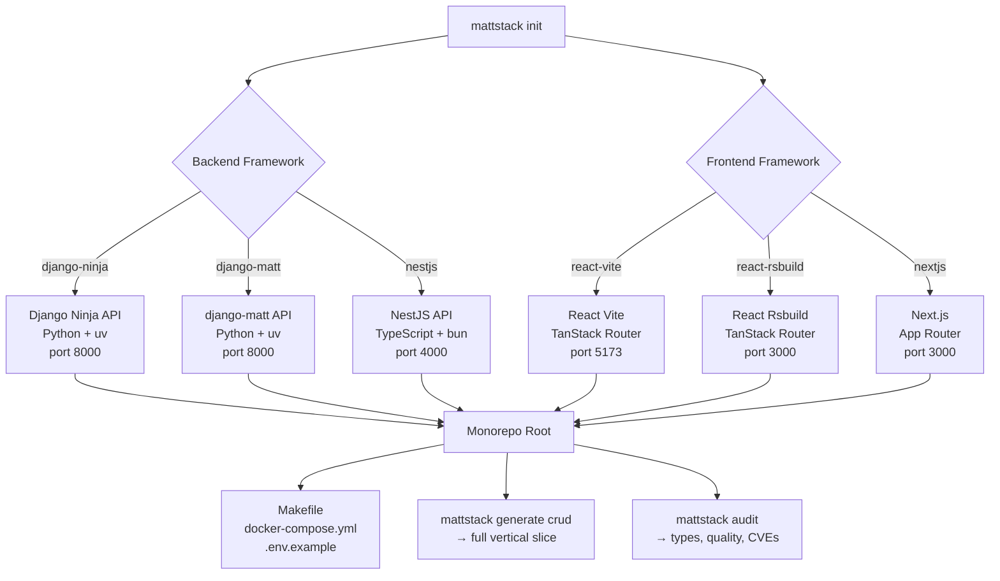

# mattstack

[](https://www.python.org/downloads/)
[](CHANGELOG.md)
[](LICENSE)
[](#development)

CLI to scaffold fullstack monorepos from battle-tested boilerplates, then generate features and audit for quality.

Skip the week of project setup — `mattstack init` clones production-ready backend and React boilerplates, wires them together, and hands you a running monorepo in under a minute. From there, `generate crud` scaffolds a complete full-stack feature in one command. The `audit` command keeps the codebase honest: type drift, missing tests, stub endpoints, hardcoded credentials, and CVEs — all surfaced in one pass.

---

## Supported Stacks

### Backends

| Framework | Language | Description |
|-----------|----------|-------------|
| `django-ninja` | Python | Django Ninja Extra — async REST API with Pydantic schemas |
| `django-matt` | Python | MattAPI controllers + CRUDService pattern |
| `fastapi` | Python | FastAPI + SQLAlchemy (async) + Alembic + Celery + Redis |
| `nestjs` | TypeScript | NestJS v11 + Fastify + Drizzle ORM + JWT/OAuth/WebAuthn |

### Frontends

| Framework | Bundler | Description |
|-----------|---------|-------------|
| `react-vite` | Vite | React + TanStack Router + TanStack Query |
| `react-vite-starter` | Vite | React + React Router (simpler setup) |
| `react-rsbuild` | Rsbuild | React + TanStack Router (Rust-powered builds) |
| `react-rsbuild-kibo` | Rsbuild | React + Kibo UI (dashboards, kanban, calendars) |
| `nextjs` | Next.js | Next.js App Router + TypeScript + Tailwind |

---

## Quick Start

```bash
# Install
pip install mattstack

# Scaffold a project (interactive)
mattstack init

# Or with a preset
mattstack init my-app -p nestjs-fullstack
mattstack init my-app -p starter-fullstack
mattstack init my-app -p nestjs-api          # NestJS API only

# Generate a full-stack CRUD feature
cd my-app
mattstack generate crud Product --fields "name:str price:decimal"

# Audit the project
mattstack audit
```

---

## Monorepo Structure

```
my-app/
├── backend/          # API (Django or NestJS) — cloned + customized
├── frontend/         # React / Next.js — cloned + wired to backend
├── ios/              # Swift iOS client (optional)
├── docker-compose.yml
├── Makefile          # setup, up, down, test, lint, format, migrate
├── .env.example
├── .pre-commit-config.yaml
└── README.md
```

### Folder layout options

mattstack generates a **monorepo with embedded subfolders** — `backend/` and `frontend/` sit side-by-side under a shared root git repo.

```
my-app/           ← git root
  backend/        ← API (backend/pyproject.toml or backend/package.json)
  frontend/       ← UI  (frontend/package.json)
```

This is the same layout whether you use Django or NestJS on the backend, and any React variant on the frontend. The root Makefile and docker-compose glue everything together.

---

## Architecture Diagram



---

## Presets

Run `mattstack info` to list all presets. Use `-p <preset>` with `mattstack init`.

### Django presets

| Preset | Backend | Frontend | Celery |
|--------|---------|----------|--------|
| `starter-fullstack` | django-ninja | react-vite | yes |
| `b2b-fullstack` | django-ninja | react-vite | yes |
| `starter-api` | django-ninja | — | yes |
| `b2b-api` | django-ninja | — | yes |
| `rsbuild-fullstack` | django-ninja | react-rsbuild | yes |
| `kibo-fullstack` | django-ninja | react-rsbuild-kibo | yes |
| `nextjs-fullstack` | django-ninja | nextjs | yes |
| `matt-api` | django-matt | — | yes |
| `matt-fullstack` | django-matt | react-vite | yes |
| `matt-b2b-fullstack` | django-matt | react-vite | yes |

### FastAPI presets

| Preset | Backend | Frontend | Celery |
|--------|---------|----------|--------|
| `fastapi-api` | fastapi | — | yes |
| `fastapi-fullstack` | fastapi | react-vite | yes |
| `fastapi-b2b-fullstack` | fastapi | react-vite | yes |
| `fastapi-rsbuild-fullstack` | fastapi | react-rsbuild | yes |
| `fastapi-nextjs-fullstack` | fastapi | nextjs | yes |

### NestJS presets

| Preset | Backend | Frontend | Notes |
|--------|---------|----------|-------|
| `nestjs-api` | nestjs | — | API only, port 4000 |
| `nestjs-fullstack` | nestjs | react-vite | Full monorepo |
| `nestjs-rsbuild-fullstack` | nestjs | react-rsbuild | Full monorepo |
| `nestjs-nextjs-fullstack` | nestjs | nextjs | Full monorepo |

### Frontend-only presets

| Preset | Framework |
|--------|-----------|
| `starter-frontend` | react-vite |
| `simple-frontend` | react-vite-starter |
| `rsbuild-frontend` | react-rsbuild |
| `kibo-frontend` | react-rsbuild-kibo |
| `nextjs-frontend` | nextjs |

---

## Generate: Full-Stack Feature in One Command

```bash
mattstack generate crud Product --fields "name:str price:decimal"
```

**Files created (Django backend):**

```
backend/apps/products/models/product.py      ← Django model
backend/apps/products/schemas/product.py     ← Pydantic schemas
backend/apps/products/api/product.py         ← Django Ninja router
backend/apps/products/admin/product_admin.py ← Admin registration
frontend/src/api/product.ts                  ← TypeScript API client
frontend/src/hooks/useProducts.ts            ← TanStack Query hooks
frontend/src/components/ProductList/index.tsx ← React component
```

Other generators: `model`, `endpoint`, `component`, `page`, `hook`, `schema`.

---

## Commands Overview

```
mattstack init        Scaffold a new project
mattstack add         Add frontend/backend/ios to existing project
mattstack generate    Generate models, CRUDs, components, hooks
mattstack db          Database operations (migrate, seed, reset, shell)
mattstack sync        Sync types/zod/api-client between stacks
mattstack test        Run all tests (parallel supported)
mattstack lint        Lint all code (parallel supported)
mattstack fmt         Format all code
mattstack audit       Static analysis (6 domains)
mattstack dev         Start all services
mattstack deps        Dependency management (check, update, audit)
mattstack health      Service health checks
mattstack hooks       Git hooks (install, status, run)
mattstack workflow    Generate CI/CD (GitHub Actions, GitLab CI)
mattstack env         Manage .env files
mattstack protect     Enable branch protection (hooks, CODEOWNERS, ruleset)
mattstack board       Pluggable kanban board (Axis backend + stubs)
mattstack todo        Move completed tasks to completed.md (date + SHA)
mattstack notify      Send deploy notifications (hermes/telegram/webhook)
mattstack verify      Enforce plan scope on changed files
mattstack rules       Generate AI context files; sync harness adapters
mattstack context     Dump project context (for AI prompts)
mattstack info        Show presets, repos, frameworks
mattstack doctor      Check dev environment
mattstack version     Show version
mattstack completions Shell completions (bash/zsh/fish)
```

Full reference: [docs/commands.md](docs/commands.md)

---

## FastAPI Backend Details

The `fastapi-boilerplate` is a production-ready async Python stack:

- **Framework**: FastAPI + Uvicorn (ASGI, fully async)
- **ORM**: SQLAlchemy 2.0 (async) + Alembic migrations + asyncpg driver
- **Auth**: JWT (python-jose) + bcrypt + TOTP (pyotp) + WebAuthn
- **Queues**: Celery + Redis (same pattern as Django backends)
- **Email**: Resend integration
- **File storage**: aioboto3 (S3-compatible)
- **Payments**: Stripe
- **Admin**: SQLAdmin panel at `/admin`
- **Observability**: OpenTelemetry + Sentry + Prometheus
- **Testing**: pytest + pytest-asyncio (real DB integration tests)
- **Tooling**: uv (package manager), ruff (lint + format)

Runs on **port 8000** alongside any React frontend.

```bash
# FastAPI monorepo workflow
mattstack init my-app -p fastapi-fullstack
cd my-app
make setup             # uv sync --extra dev (backend) + bun install (frontend)
make up                # Start Postgres + Redis via Docker
make backend-migrate   # Run Alembic migrations
make backend-dev       # http://localhost:8000 (docs at /docs)
make frontend-dev      # http://localhost:5173
```

---

## NestJS Backend Details

The `nestjs-boilerplate` is a production-ready NestJS v11 stack:

- **Runtime**: Node.js + Fastify (faster than Express)
- **ORM**: Drizzle ORM + PostgreSQL
- **Auth**: JWT (access + refresh) + Google/GitHub OAuth + WebAuthn/passkeys
- **Queues**: Bull (Redis-based — no Celery needed)
- **Email**: Resend integration
- **File storage**: Local or S3/Cloudflare R2
- **Payments**: Stripe
- **Observability**: OpenTelemetry + Sentry
- **Testing**: Jest + mutation testing (Stryker)
- **Tooling**: Biome (lint + format), bun (package manager)

In monorepo mode, the NestJS API runs on **port 4000** (to avoid conflicts with React dev servers on 3000/5173). The generated root `.env` and Makefile are pre-configured for this.

```bash
# NestJS monorepo workflow
mattstack init my-app -p nestjs-fullstack
cd my-app
make setup         # bun install (backend) + bun install (frontend)
make up            # Start Postgres + Redis via Docker
make backend-migrate   # Run Drizzle migrations
make backend-dev   # http://localhost:4000
make frontend-dev  # http://localhost:5173
```

---

## Audit

MattStack delegates every check to [Gauntlet](https://github.com/mattjaikaran/gauntlet),
the verification engine. MattStack scaffolds and manages the project; Gauntlet verifies it.
MattStack runs `gauntlet check --tier=full --json` and formats the findings. It implements
no checks of its own.

```bash
mattstack audit                          # Run the full tier
mattstack audit --tier standard          # Deterministic checks + plan conformance
mattstack audit --type sentinel          # Limit to the deterministic engine
mattstack audit --type review            # Limit to the AI review board
mattstack audit -s error                 # Show errors only
mattstack audit --json                   # Machine-readable output
mattstack audit --html                   # HTML dashboard
mattstack gauntlet check --tier fast     # Call Gauntlet through mattstack
mattstack gauntlet run vault show        # Any Gauntlet subcommand
```

| Engine | What it checks |
|--------|----------------|
| `sentinel` | Format, lint, type check, tests, coverage, complexity, secrets, suppression, git integrity |
| `conformance` | The diff against the plan and the linked ticket |
| `review` | AI review board: architect, senior engineer, security, performance, readability |
| `quality` | Mutation score and performance regression (release tier) |

Results are printed as a Rich table and written to `tasks/todo.md`. The audit reads
`[integrations]` from the project's `gauntlet.toml` for the binary path, and skips with one
line when Gauntlet is not installed and the project opted in.

`mattstack init` writes a `gauntlet.toml` for the detected stack. Install Gauntlet
separately; see [the Gauntlet guide](docs/gauntlet.md).

---

## Installation

```bash
pip install mattstack

# Or install from source
git clone https://github.com/mattjaikaran/mattstack-cli
cd mattstack-cli
uv sync --extra dev
uv run mattstack --help
```

---

## Development

```bash
uv sync --extra dev     # Install with dev deps
uv run pytest -x -q    # 783 tests
uv run ruff check src/ tests/
uv run ruff format src/ tests/
```

---

## Source Repositories

| Key | Repository |
|-----|-----------|
| `django-ninja` | [django-ninja-boilerplate](https://github.com/mattjaikaran/django-ninja-boilerplate) |
| `django-matt` | [django-matt-boilerplate](https://github.com/mattjaikaran/django-matt-boilerplate) |
| `nestjs` | [nestjs-boilerplate](https://github.com/mattjaikaran/nestjs-boilerplate) |
| `react-vite` | [react-vite-boilerplate](https://github.com/mattjaikaran/react-vite-boilerplate) |
| `react-vite-starter` | [react-vite-starter](https://github.com/mattjaikaran/react-vite-starter) |
| `react-rsbuild` | [react-rsbuild-boilerplate](https://github.com/mattjaikaran/react-rsbuild-boilerplate) |
| `react-rsbuild-kibo` | [react-rsbuild-kibo-boilerplate](https://github.com/mattjaikaran/react-rsbuild-kibo-boilerplate) |
| `nextjs` | [nextjs-starter](https://github.com/mattjaikaran/nextjs-starter) |
| `swift-ios` | [swift-ios-starter](https://github.com/mattjaikaran/swift-ios-starter) |

---

## Extending

### Custom repos

Override any repo URL via `~/.mattstack/config.yaml`:

```yaml
repos:
  nestjs: https://github.com/your-org/your-nestjs-fork.git
  react-vite: https://github.com/your-org/your-frontend.git
```

### Custom presets

```yaml
presets:
  my-api:
    description: My standard API
    project_type: backend-only
    variant: starter
    backend_framework: nestjs
```

### Custom audit checks

Add the check to Gauntlet, not to MattStack. See [docs/gauntlet.md](docs/gauntlet.md).

---

## Docs

- [Commands reference](docs/commands.md)
- [Architecture](docs/architecture.md)
- [Ecosystem & customization](docs/ecosystem.md)
- [Deployment guide](docs/deployment-guide.md)
- [Gauntlet integration](docs/gauntlet.md)

---

## License

Apache-2.0 — see [LICENSE](LICENSE).
