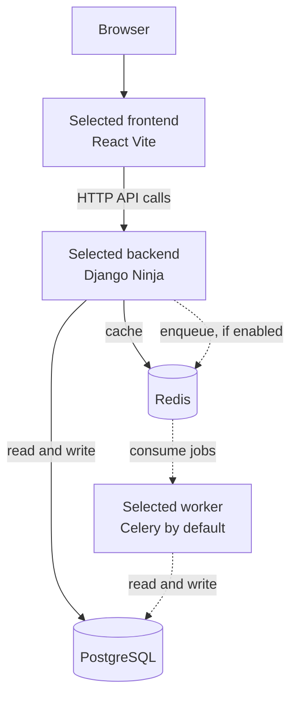

# mattstack

[](https://www.python.org/downloads/)
[](CHANGELOG.md)
[](LICENSE)

Scaffold a selected backend and frontend, generate features, and inspect the resulting project.

Use mattstack as the project control plane. It clones the selected source repositories,
customizes their configuration, and generates root runtime and quality commands.
Your applications run from the generated project; they do not run inside mattstack.

Choose a fullstack, backend-only, or frontend-only preset. Supported frameworks are
alternatives, not services that every project installs. Review generated code and
source contracts before you deploy; scaffolding is not production certification.

---

## Supported stacks

### Backends

| Framework | Language | Description |
|-----------|----------|-------------|
| `django-ninja` | Python | Django Ninja Extra — async REST API with Pydantic schemas |
| `django-matt` | Python | MattAPI controllers + CRUDService pattern |
| `fastapi` | Python | FastAPI + SQLAlchemy (async) + Alembic + Celery + Redis |
| `nestjs` | TypeScript | NestJS v11 + Fastify + Drizzle ORM + JWT/OAuth/WebAuthn |

### Frontends

| Framework | Bundler | Description |
|-----------|---------|-------------|
| `react-vite` | Vite | React + TanStack Router + TanStack Query |
| `react-vite-starter` | Vite | React + React Router (simpler setup) |
| `react-rsbuild` | Rsbuild | React + TanStack Router (Rust-powered builds) |
| `react-rsbuild-kibo` | Rsbuild | React + Kibo UI (dashboards, kanban, calendars) |
| `nextjs` | Next.js | Next.js App Router + TypeScript + Tailwind |

---

## Quick start

Install the CLI with `uv`. Install Docker for local database/cache containers and
`bun` for JavaScript components.

```bash
uv tool install git+https://github.com/mattjaikaran/mattstack-cli
mattstack init my-app -p starter-fullstack
cd my-app
make setup
make up
mattstack db migrate
mattstack dev --mode host
```

Run application commands from the generated project root. `make up` starts the
shared infrastructure; host mode runs the selected applications on your machine.
Use `mattstack dev --mode docker` for container application development instead.
Do not run both modes on the same ports.

For unattended scaffolding, use a preset or a
[scaffold YAML file](docs/commands.md#mattstack-init), not the interactive wizard.
Run `mattstack init --help` to inspect runtime flags and `mattstack info` to inspect presets.

---

## Generated project layout

This tree shows a fullstack project. Frontend-only projects omit the backend,
shared Compose infrastructure, and root environment files. Provider recipes
can still add the frontend deployment files they need.

```
my-app/
├── backend/          # Selected API; omitted for frontend-only projects
├── frontend/         # Selected UI; omitted for backend-only projects
├── ios/              # Swift iOS client (optional)
├── docker-compose.yml
├── Makefile          # setup, up, down, test, lint, format, migrate
├── .env.example
├── .pre-commit-config.yaml
└── README.md
```

### Folder layout options

mattstack generates a **monorepo with embedded subfolders** — `backend/` and `frontend/` sit side-by-side under a shared root git repo.

```
my-app/           ← git root
  backend/        ← API (backend/pyproject.toml or backend/package.json)
  frontend/       ← UI  (frontend/package.json)
```

The layout is the same for the supported backend and frontend families. Ports and
commands come from the selected configuration. Check the generated README and
`mattstack context` instead of assuming a source repository's standalone ports.

---

## Architecture: one selected stack

This example shows `starter-fullstack`: one Django Ninja API and one React Vite UI.
It does **not** combine all supported frameworks. Solid arrows show application
traffic. Dashed arrows show optional background-job traffic.


```mermaid
flowchart TD
    browser["Browser"] --> ui["Selected frontend<br/>React Vite"]
    ui -->|"HTTP API calls"| api["Selected backend<br/>Django Ninja"]
    api -->|"read and write"| db[("PostgreSQL")]
    api -->|"cache"| redis[("Redis")]
    api -. "enqueue, if enabled" .-> redis
    redis -. "consume jobs" .-> worker["Selected worker<br/>Celery by default"]
    worker -. "read and write" .-> db
```

Use a backend-only preset to omit the UI, or a frontend-only preset to omit the
API and its infrastructure. With `--task-backend none`, omit the queue consumer.
Realtime and production S3 storage are opt-in Ninja profiles, not default services.

Keep three views separate:

- [CLI architecture](docs/architecture.md): configuration, planners, and file writes.
- [Command contracts](docs/commands.md): resource policies, routing, workers, and checks.
- [Deployment topology](docs/deployment-guide.md): public edges, internal services,
  provider prerequisites, and health probes.

---

## Presets

Run `mattstack info` to list all presets. Use `-p <preset>` with `mattstack init`.

### Django presets

| Preset | Backend | Frontend | Celery by default |
|--------|---------|----------|--------|
| `starter-fullstack` | django-ninja | react-vite | yes |
| `b2b-fullstack` | django-ninja | react-vite | yes |
| `starter-api` | django-ninja | — | yes |
| `b2b-api` | django-ninja | — | yes |
| `rsbuild-fullstack` | django-ninja | react-rsbuild | yes |
| `kibo-fullstack` | django-ninja | react-rsbuild-kibo | yes |
| `nextjs-fullstack` | django-ninja | nextjs | yes |
| `matt-api` | django-matt | — | yes |
| `matt-fullstack` | django-matt | react-vite | yes |
| `matt-b2b-fullstack` | django-matt | react-vite | yes |

### FastAPI presets

| Preset | Backend | Frontend | Celery by default |
|--------|---------|----------|--------|
| `fastapi-api` | fastapi | — | yes |
| `fastapi-fullstack` | fastapi | react-vite | yes |
| `fastapi-b2b-fullstack` | fastapi | react-vite | yes |
| `fastapi-rsbuild-fullstack` | fastapi | react-rsbuild | yes |
| `fastapi-nextjs-fullstack` | fastapi | nextjs | yes |

### NestJS presets

| Preset | Backend | Frontend | Notes |
|--------|---------|----------|-------|
| `nestjs-api` | nestjs | — | API only, port 4000 |
| `nestjs-fullstack` | nestjs | react-vite | Full monorepo |
| `nestjs-rsbuild-fullstack` | nestjs | react-rsbuild | Full monorepo |
| `nestjs-nextjs-fullstack` | nestjs | nextjs | Full monorepo |

### Frontend-only presets

| Preset | Framework |
|--------|-----------|
| `starter-frontend` | react-vite |
| `simple-frontend` | react-vite-starter |
| `rsbuild-frontend` | react-rsbuild |
| `kibo-frontend` | react-rsbuild-kibo |
| `nextjs-frontend` | nextjs |

---

## Generate a resource

For a Django Ninja or Django Matt project, plan a backend resource and its
frontend client, hooks, and routes together:

```bash
mattstack generate crud Product --fields "name:str price:decimal" --dry-run
mattstack generate crud Product --fields "name:str price:decimal"
```

The planner detects the existing backend app and frontend router. It validates
both plans before it writes files. Paths depend on that layout; they are not
fixed to `backend/apps/products`.

Choose the access policy explicitly:

- `--scope owned --owner-field owner` binds a user foreign key on the server and
  isolates reads and mutations to the authenticated owner.
- `--scope global` permits public reads. Writes require JWT when the backend
  has JWT auth; without it, writes are public too. Review the printed warning.
  Ninja's route-auth gate needs an explicit review of the generated public GETs;
  the generator does not add a waiver.

Use `--with-service` for a separate service layer and `--lifecycle` for the
supported model lifecycle. A browser route guard is a navigation control,
not backend authorization. See the
[resource and routing reference](docs/commands.md#generate) before you generate.

Other generators include `model`, `endpoint`, `component`, `page`, `hook`, and `schema`.

---

## Command overview

```
mattstack init        Scaffold a new project
mattstack add         Add frontend/backend/ios to existing project
mattstack generate    Generate models, CRUDs, components, hooks
mattstack db          Database operations (migrate, seed, reset, shell)
mattstack sync        Sync types/Zod/api-client or generate from OpenAPI
mattstack test        Run all tests (parallel supported)
mattstack lint        Lint all code (parallel supported)
mattstack fmt         Format all code
mattstack audit       Static analysis (6 domains)
mattstack dev         Start all services
mattstack deps        Dependency management (check, update, audit)
mattstack health      Service health checks
mattstack hooks       Git hooks (install, status, run)
mattstack workflow    Generate GitHub Actions or GitLab CI
mattstack env         Manage .env files
mattstack protect     Enable branch protection (hooks, CODEOWNERS, ruleset)
mattstack board       Pluggable kanban board (Axis backend + stubs)
mattstack todo        Move completed tasks to completed.md (date + SHA)
mattstack notify      Send deploy notifications (hermes/telegram/webhook)
mattstack verify      Enforce plan scope on changed files
mattstack rules       Generate AI context files; sync harness adapters
mattstack context     Dump project context (for AI prompts)
mattstack info        Show presets, repos, frameworks
mattstack doctor      Check dev environment
mattstack version     Show version
mattstack completions Shell completions (bash/zsh/fish)
```

Full reference: [docs/commands.md](docs/commands.md)

---

## Runtime choices

Select runtime services independently of the frontend:

| Backend | Task choices | Migration target |
|---|---|---|
| Django Ninja | `celery`, `huey`, `django_q`, `django_rq`, `dramatiq`, `none` | `make backend-migrate` |
| Django Matt | `celery`, `none` | `make backend-migrate` |
| FastAPI | `celery`, `none` | `make backend-migrate` (Alembic) |
| NestJS | Source Bull queues; not the Python task facade | `make backend-migrate` (Drizzle) |

Only emitted worker targets exist. `make backend-worker` starts the selected
consumer; `make backend-beat` exists only for Celery. Disabled Ninja dispatch
rejects enqueue attempts rather than dropping jobs.

```bash
mattstack init task-api -p starter-api --task-backend huey
cd task-api
make setup
make up
mattstack db migrate
make backend-worker
```

Keep secrets in environment files, not persisted project metadata. Use separate
production values. See the [runtime reference](docs/commands.md#mattstack-init)
for realtime and S3 prerequisites, and the
[deployment guide](docs/deployment-guide.md) for provider mode and secret checks.

---

## Source capabilities and verification

Scaffolding support does not mean every source feature shares a contract.
For example, Django CRUD planners do not generate FastAPI or NestJS resources,
and a B2B frontend is not a drop-in replacement for another source's API.

`init` clones the configured repository URLs. Local edits to a sibling boilerplate
do not reach a new scaffold until you publish them or configure a source override.
Run `make setup`, review dependency lock changes, and check the selected source's
quality tools. Use the [ecosystem guide](docs/ecosystem.md) to configure sources.

Keep evidence specific:

- A build proves the selected build path, not authentication or production readiness.
- A route guard does not prove API authorization.
- A local production-image smoke does not prove cloud IAM or provider networking.
- Nonblocking quality findings remain warnings, not an all-clear result.

---

## Audit

Six audit domains in one pass:

```bash
mattstack audit                         # All domains
mattstack audit --type types          # Pydantic ↔ TypeScript drift
mattstack audit --type quality        # TODOs, stubs, hardcoded creds
mattstack audit --type endpoints      # Missing/unimplemented endpoints
mattstack audit --type tests          # Coverage gaps
mattstack audit --type dependencies   # Outdated packages
mattstack audit --type vulnerabilities # CVE scan
mattstack audit --html                  # HTML dashboard
```

Results are printed as a Rich table and appended to `tasks/todo.md`.

---

## Installation

```bash
uv tool install git+https://github.com/mattjaikaran/mattstack-cli

# Or install from source
git clone https://github.com/mattjaikaran/mattstack-cli
cd mattstack-cli
uv sync --extra dev
uv run mattstack --help
```

---

## Development

```bash
uv sync --extra dev     # Install with dev deps
uv run pytest -x -q
uv run ruff check src/ tests/
uv run ruff format src/ tests/
make gauntlet-quick     # Format, lint, types, security, architecture, length, tests, install
```

---

## Source repositories

| Key | Repository |
|-----|-----------|
| `django-ninja` | [django-ninja-boilerplate](https://github.com/mattjaikaran/django-ninja-boilerplate) |
| `django-matt` | [Configured source](docs/ecosystem.md#source-provenance) |
| `fastapi` | [fastapi-boilerplate](https://github.com/mattjaikaran/fastapi-boilerplate) |
| `nestjs` | [nestjs-boilerplate](https://github.com/mattjaikaran/nestjs-boilerplate) |
| `react-vite` | [react-vite-boilerplate](https://github.com/mattjaikaran/react-vite-boilerplate) |
| `react-vite-starter` | [react-vite-starter](https://github.com/mattjaikaran/react-vite-starter) |
| `react-rsbuild` | [react-rsbuild-boilerplate](https://github.com/mattjaikaran/react-rsbuild-boilerplate) |
| `react-rsbuild-kibo` | [react-rsbuild-kibo-boilerplate](https://github.com/mattjaikaran/react-rsbuild-kibo-boilerplate) |
| `nextjs` | [nextjs-starter](https://github.com/mattjaikaran/nextjs-starter) |
| `swift-ios` | [swift-ios-starter](https://github.com/mattjaikaran/swift-ios-starter) |

Resolve the active repository through the configured source key. Use the
[source provenance guide](docs/ecosystem.md#source-provenance) to check overrides,
published commits, and compatibility before you substitute another source.

---

## Extending

### Custom repos

Override any repo URL via `~/.mattstack/config.yaml`:

```yaml
repos:
  nestjs: https://github.com/your-org/your-nestjs-fork.git
  react-vite: https://github.com/your-org/your-frontend.git
```

### Custom presets

```yaml
presets:
  my-api:
    description: My standard API
    project_type: backend-only
    variant: starter
    backend_framework: nestjs
```

### Custom audit plugins

See [docs/plugin-guide.md](docs/plugin-guide.md).

---

## Docs

- [Commands reference](docs/commands.md)
- [Architecture](docs/architecture.md)
- [Ecosystem & customization](docs/ecosystem.md)
- [Deployment guide](docs/deployment-guide.md)
- [Audit plugin guide](docs/plugin-guide.md)

---

## License

Apache-2.0 — see [LICENSE](LICENSE).
