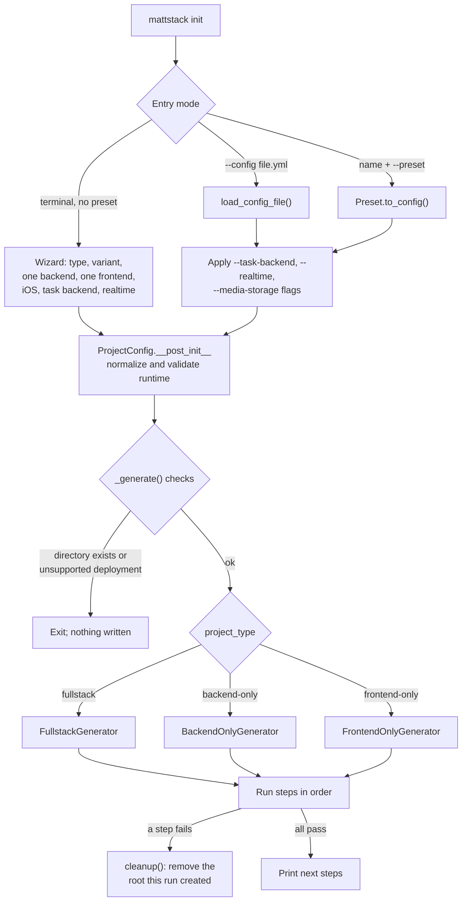
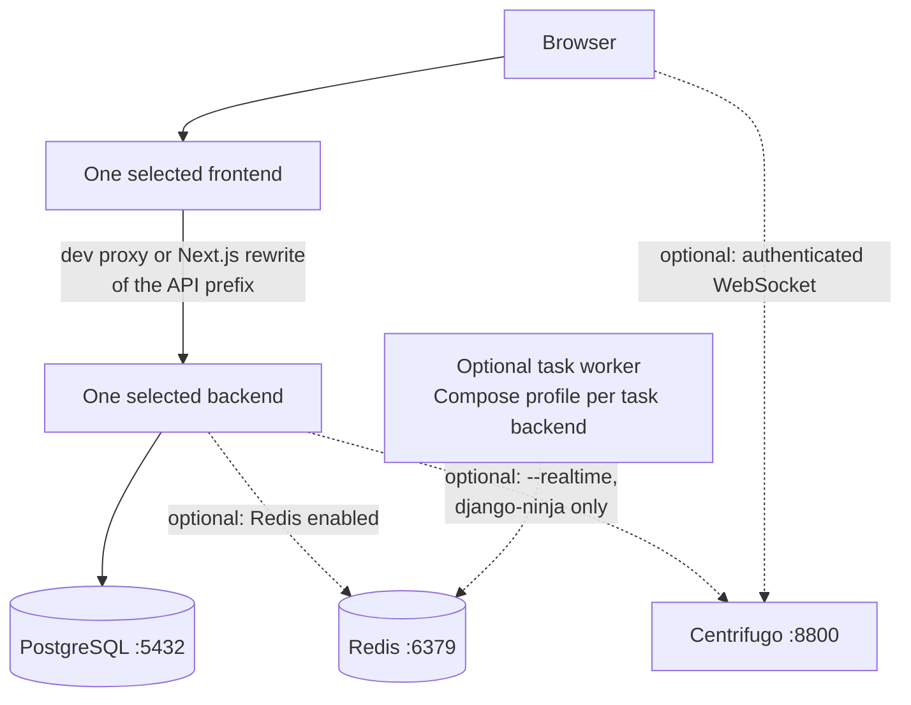
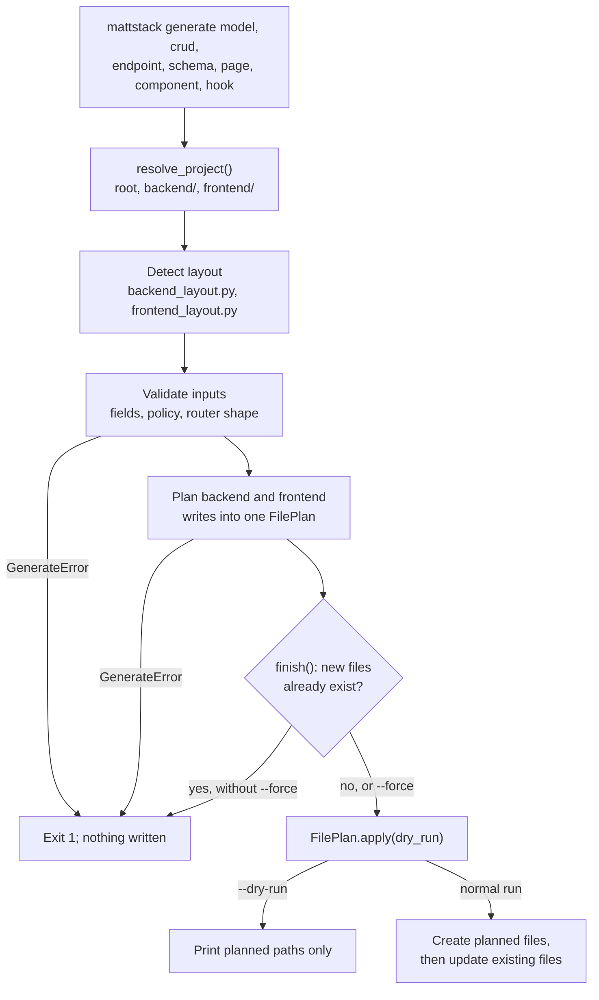
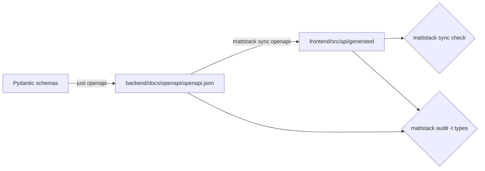

# mattstack architecture

This page explains how the mattstack CLI turns your choices into one
generated project, and how later commands change that project safely. For
flags and examples, see the [CLI reference](commands.md). For production
targets, see the [deployment guide](deployment-guide.md). For custom
boilerplate repos, presets, and optional tools, see the
[ecosystem guide](ecosystem.md). For custom auditors, see the
[plugin guide](plugin-guide.md).

## Two views: the CLI and the generated project

Keep these two views separate:

- **The CLI (this repository)** knows every supported backend and frontend.
  It holds their enums, source repo URLs, presets, templates, and code
  generators.
- **A generated project** contains only the components you selected: at most
  one backend in `backend/`, at most one frontend in `frontend/`, and an
  optional iOS client in `ios/`. The CLI does not install the other
  frameworks.

| Role | Supported choices in the CLI | Selected in one project |
|------|------------------------------|-------------------------|
| Project type | `fullstack`, `backend-only`, `frontend-only` | Exactly one |
| Backend | `django-ninja`, `django-matt`, `fastapi`, `nestjs` | One, or none for `frontend-only` |
| Frontend | `react-vite`, `react-vite-starter`, `react-rsbuild`, `react-rsbuild-kibo`, `nextjs` | One, or none for `backend-only` |
| iOS client | `swift-ios` | Optional, `fullstack` only |
| Task backend | `celery`, `huey`, `django_q`, `django_rq`, `dramatiq`, `none` | One that the backend supports; see [Task backend selection](#task-backend-selection) |
| Realtime | Centrifugo | Optional, `django-ninja` only |
| Media storage | `local`, `s3` | One; `s3` needs `django-ninja` |
| Deployment target | `docker`, `railway`, `render`, `fly-io`, `cloudflare`, `digital-ocean`, `aws`, `gcp`, `hetzner`, `self-hosted` | One; `init` refuses unsupported combinations |

## Init pipeline

`mattstack init` resolves your choices into one `ProjectConfig`, then runs
one generator. Each step returns success or failure. A failure removes the
project directory that this run created.



### How init resolves choices

1. `run_init()` selects one entry mode. `--config` cannot combine with a
   name or `--preset`. Without a terminal, you must pass `--preset` with a
   name, or `--config`.
2. Runtime flags override the config file or preset. The wizard asks only
   for the runtime choices that flags did not set, and it lists only the
   task backends that the selected backend supports.
3. `ProjectConfig.__post_init__` normalizes the choice set:
   - `frontend-only` sets the task backend to `none` and turns off Redis,
     iOS, realtime, and S3 media.
   - `nestjs` maps the legacy Celery default to `none` and keeps Redis on,
     because Bull runs inside the NestJS API.
   - `django-ninja` always uses Redis. Any task backend other than `none`
     also turns on Redis.
   - An unsupported task backend, realtime, or media choice raises
     `ValueError`. `init` prints the valid choices and exits before it
     creates any file.
4. `_generate()` refuses an existing directory and a deployment target that
   cannot run the stack, for example Next.js on Cloudflare.

### What each generator writes

The generator clones only the selected source repos. `clone_and_strip()`
shallow-clones the default branch of the URL in `REPO_URLS`, or your
override from `~/.mattstack/config.yaml`. It then removes the `.git`
history. A fresh `init` therefore uses the published boilerplates, not
unpublished local changes.

| Step | Fullstack | Backend-only | Frontend-only |
|------|:---------:|:------------:|:-------------:|
| Create the project directory | yes | yes | yes |
| Clone the selected backend into `backend/` | yes | yes | no |
| Clone the selected frontend into `frontend/` | yes | no | yes |
| Clone the iOS starter into `ios/` | if `--ios` | no | no |
| Consolidate component root files | yes | yes | no |
| Check task and realtime prerequisites | yes | yes | no |
| Write root files (Makefile, README, agent files, `gauntlet.toml`, `.gitignore`, deployment files) | yes | yes | yes |
| Write Compose files, `.env*`, and Dockerfiles | yes | yes | no |
| Write the root `.pre-commit-config.yaml` | yes | yes | yes |
| Customize cloned components (names; frontend bundler config and API proxy) | yes | backend only | frontend only |
| Write `mattstack.yml` and `.dockerignore` | yes | yes | yes |
| Initialize Git with a first commit | yes | yes | yes |

Frontend-only provider recipes can add image files separately. Fly emits a
frontend Dockerfile; Render and DigitalOcean emit one for Next.js. Static-site
recipes do not need those containers.

`--dry-run` runs the same steps but prints each action instead of writing.

## Generated project runtime

A generated project runs only its selected components. The diagram shows a
fullstack project. A backend-only project has no frontend node. A
frontend-only project has only the frontend.



- Dashed edges are optional. Task workers and Centrifugo start only with
  their Compose profile, so `docker compose up` alone starts the same core
  services.
- `mattstack dev` runs in host mode by default: Compose starts only the
  database and Redis, and the app servers run on your machine. Container
  mode runs the `api-dev` and `frontend-dev` Compose services instead.
- The production Compose file and deployment recipes follow the same
  selection. See the [deployment guide](deployment-guide.md) for the
  production prerequisites and the verification boundary.

### Default ports

| Service | Default | Override |
|---------|---------|----------|
| Backend API | 8000 for Python backends, 4000 for NestJS | `API_PORT` |
| Frontend dev server | 3000 for every frontend | `FRONTEND_PORT` |
| PostgreSQL | 5432 | `DB_PORT` |
| Redis | 6379 | `REDIS_PORT` |

`resolve_project()` reads each port from the root `.env` first, then from
`project.ports` in `mattstack.yml`, then from these defaults. Commands use
the resolved project. Do not add a second detection path.

## Project metadata and secret environment

Generated projects keep stack facts and secrets in different files:

| File | Content | In Git |
|------|---------|--------|
| `mattstack.yml` | Control-plane settings (`deps`, `scope`, `board`, `notify`) and the `project:` stack metadata | Yes |
| `.env.example`, `.env.production.example` | Variable names with placeholder values | Yes |
| `.env` | Local values with generated secrets (`utils/env_secrets.py`), mode 0600 | No |
| `.env.production` | Production values with separately generated secrets, mode 0600. Replace the remaining placeholders before you deploy. | No |

`save_project_config()` writes only nonsecret choices under `project:`:
name, type, variant, iOS, deployment target, execution mode, the backend
framework, directory, Redis, API prefix, task backend, realtime, media
storage, AI store (`ai`), graph (`graph`), and settings module, the frontend
framework and directory, and ports. It overwrites scaffold choices, keeps
user-tuned values such as ports, and keeps every other key and comment.
Configuration that needs a credential names an environment variable, for
example `board.api_key_env`, instead of the value. `utils/sources.py` adds
each component's `source` record (`repo`, `commit`, and `dirty`), which
`mattstack upgrade` uses as the merge base.

`init` never prints a secret value, and it never overwrites an existing
`.env` or `.env.production`. `mattstack env secrets` creates a missing file
from its example with the same generator.

When a command reads an existing project, persisted metadata wins over
filesystem detection. Detection in `stack_detection.py` returns `None` for
a framework it does not recognize, and callers refuse rather than guess.

## Task backend selection

`ProjectConfig.task_backend` is the single runtime selection. `use_celery`
is a derived property, not a constructor argument.

| Backend | Supported task backends | Worker processes |
|---------|-------------------------|------------------|
| `django-ninja` | `celery`, `huey`, `django_q`, `django_rq`, `dramatiq`, `none` | Celery worker and beat, or one worker for the other backends |
| `django-matt`, `fastapi` | `celery`, `none` | Celery worker and beat |
| `nestjs` | `none` | None; Bull queues run inside the API |
| Frontend-only | `none` | None |

For `django-ninja`, the generator writes `TASK_BACKEND` to the environment
files. Before it writes root files, `prepare_runtime()` checks the cloned
backend:

- It adds the disabled `none` backend to `api/tasks/loader.py` when the
  clone does not have it. With `none`, `.delay()` raises
  `TaskDispatchDisabled` instead of queueing a job that no worker reads.
- It fails when the loader does not list the selected backend, when
  `pyproject.toml` lacks the backend's optional extra, or when realtime
  files are missing.

For an existing project, `runtime_kwargs()` resolves the task backend in
this order: `project.backend.task_backend`, then `TASK_BACKEND` in `.env`
for `django-ninja`, then the legacy `celery` flag, then a `celery`
dependency in the backend manifest.

## Code generation: plan, validate, then write

`mattstack generate` commands collect every create and update in one
`FilePlan` in memory. All validation runs before the first write. A
`GenerateError` at any point means that nothing was written.



- `generate crud` plans the backend and the frontend in the same plan, so
  a refused frontend route also stops the backend files.
- `FilePlan.text()` returns the planned content of a file, so later
  planners build on earlier planned edits, not stale disk content.
- `FilePlan.apply()` writes files one at a time and has no rollback. The
  guarantee covers validation and conflict errors, not an operating system
  error during the write.
- Backend generation needs a Django backend with a `NinjaExtraAPI` or
  django-matt API instance. It refuses plain `NinjaAPI`. It does not
  generate FastAPI or NestJS code.

### Router detection

`detect_frontend_layout()` reads `frontend/package.json` and selects one
router. Page and CRUD generation then use that router's own conventions.

| Dependency found | Router | Where pages go |
|------------------|--------|----------------|
| `next` | `nextjs` | App Router directory (`app/` or `src/app/`) |
| `@tanstack/react-router` | `tanstack` | Routes directory from the TanStack config (`parsers/tanstack_config.py`) |
| `react-router-dom` or `react-router` | `react-router` | `src/pages/`, registered in the route declaration |
| None of these | `unknown` | Page generation refuses |

For React Router, the generator edits one of two declaration styles: a
module that renders `<Routes>` with literal `<Route>` elements, or exactly
one `createBrowserRouter`, `createHashRouter`, `createMemoryRouter`, or
`useRoutes` call with a literal or named `const` route array. It refuses
computed, spread, or mapped routes, and `createRoutesFromElements`. Then
you register the page by hand.

A browser guard (`--guard`, or the React Router `protected` group) is a
client-side redirect. It is not authorization, and audits never report it
as a backend control.

### Resource policy: global and owned

`generate model` and `generate crud` take a resource policy.
`resource_policy.py` checks the policy against the backend before it plans
any file.

| Scope | Reads | Writes | Requirements |
|-------|-------|--------|--------------|
| `global` (default) | Every caller reads every row | Need a valid JWT when the backend has JWT auth; open to every caller when it does not | None |
| `owned` | Each caller sees only their rows; another user's row answers 404 | Every route needs a valid JWT; create sets the owner from the request user | `--owner-field` names a `name:fk:User` field, and the backend depends on `django-ninja-jwt` or `django-matt[auth]` |

- A user foreign key does not grant access by itself. Only
  `--scope owned --owner-field <field>` binds rows to a user.
- The generated module states its policy and lifecycle in its docstring.
- In a `global` resource, the list query line carries
  `# global policy; noqa: UNSCOPED_QUERY` for the backend convention gate.
  The generator does not change the route-auth contract. When the backend
  has `core/tests/test_route_auth.py`, the CLI prints a security review
  warning. Review the anonymous GET operations, and then add them to
  `PUBLIC_OPERATIONS` yourself.
- `--lifecycle soft-delete` requires a base model whose default manager
  hides inactive rows. The check refuses a base model that does not.

## Type contract

The backend's OpenAPI document is the only type contract between Python and
TypeScript. mattstack does not read Pydantic source.



- `parsers/openapi_spec.py` finds the contract (`--schema`, the Ninja export,
  or `openapi.json`) and holds the generator pin (`HEY_API_VERSION`).
- `commands/openapi.py` runs the frontend's exact-pinned
  `@hey-api/openapi-ts` with the `@hey-api/typescript`, `@hey-api/sdk`,
  `zod`, and `@tanstack/react-query` plugins. `sync check` regenerates into a
  temporary directory and compares file hashes with the committed output.
- `auditors/types.py` and `auditors/types_parity.py` compare every
  `components.schemas` entry with its `z<Name>` constant in `zod.gen.ts`:
  keys, required, nullable, enum and literal values, `$ref` targets, union
  branches, formats, and `min`/`max`/`gt`/`lt`/`pattern` bounds. Each
  difference is an `ERROR` finding. `parsers/zod_schemas.py` reads the Zod
  file with a bracket-, string-, and regex-aware scanner.
- `tests/test_auditors/test_types.py` is the round-trip test. Its fixture is
  a real Ninja export and the pinned generator's output; regenerate both when
  you change `HEY_API_VERSION`.

### Mapping

Verified with `@hey-api/openapi-ts` 0.99.0, Django Ninja, Pydantic 2, and
Zod 4.

| Pydantic | OpenAPI | Zod |
|---|---|---|
| `alias_generator=to_camel` | property `firstName` | key `firstName` |
| Field without a default | listed in `required` | no `.optional()` |
| Field with a default | not in `required` | `.optional()`, plus `.default(v)` when the schema has the default |
| `X \| None` | `anyOf: [X, {type: null}]` | `.nullable()`, or `.nullish()` when also optional |
| `Enum` | `$ref` to an `enum` component | reference to `z.enum([...])` |
| `Literal["a", "b"]` | `enum` | `z.enum(['a', 'b'])` |
| `Literal["v1"]` | `const` | `z.literal('v1')` |
| Nested model | `$ref` | reference to `z<Model>` |
| `datetime`, `date`, `time` | `string` + `date-time`, `date`, `time` | `z.iso.datetime()`, `z.iso.date()`, `z.iso.time()` |
| `UUID`, `EmailStr`, `HttpUrl` | `string` + `uuid`, `email`, `uri` | `z.uuid()`, `z.email()`, `z.url()` |
| `int`, `float`, `bool` | `integer`, `number`, `boolean` | `z.int()`, `z.number()`, `z.boolean()` |
| `Decimal` | `anyOf: [number, string]` | `z.union([z.number(), z.string()])` |
| `min_length`, `max_length` | `minLength`, `maxLength`, `minItems`, `maxItems` | `.min()`, `.max()`; `.length()` when equal |
| `ge`, `le` | `minimum`, `maximum` | `.gte()`, `.lte()` |
| `gt`, `lt` | `exclusiveMinimum`, `exclusiveMaximum` | `.gt()`, `.lt()` |
| `pattern` | `pattern` | `.regex(/.../)` |

### Known gaps

- **Decimal:** the schema accepts a number or a string. Ninja's JSON
  renderer sends `Decimal` as a string. Keep money as a string or a decimal
  type in the frontend; do not do arithmetic on `number`.
- **datetime:** `z.iso.datetime()` accepts `Z` only. It rejects offsets such
  as `+02:00` and naive values. Keep `USE_TZ = True` and UTC output.
- **int64:** `format: int64` becomes `z.coerce.bigint()` with int64 bounds,
  so parsed values are `bigint`, not `number`. Pydantic emits no int64
  format unless you declare it.
- **Untyped objects:** a property with `type: object` and no `properties` or
  `additionalProperties` is dropped from the Zod object; the parity audit
  reports it as missing. Use a model or `dict[str, T]`.
- **writeOnly and readOnly:** `writeOnly` fields (for example a password)
  are absent from `z<Name>` and present in `z<Name>Writable`; `readOnly`
  fields are the reverse. The audit compares both.
- **Not emitted:** `multipleOf`, `@field_validator` and `@model_validator`
  bodies. Put constraints on `Field(...)`, `Literal`, or an `Enum`.
- **OpenAPI 3.0:** a boolean `exclusiveMinimum` becomes `.gt(true)`; the
  audit reports it. Django Ninja exports OpenAPI 3.1.
- **Scope:** the audit compares component schemas only, not operation
  query or path parameters.

## Component guidance and quality gates

Consolidation removes each cloned component's standalone root files,
because the generated project has one root. Agent guidance follows one
rule: canonical sources stay, and harness adapters go.

- **Kept in the component:** `AGENTS.md`, `SKILLS.md`, `.agents/skills/`,
  `.omp/`, `.context/`, and committed `.claude/skills/<name>/` that no
  `.agents/skills/` or `.omp/skills/` entry duplicates. `CLAUDE.md` and
  `.cursorrules` stay when the component has no `AGENTS.md`.
- **Removed from the component:** `CLAUDE.md` and `.cursorrules` that an
  `AGENTS.md` duplicates, the rest of `.claude/` (local settings,
  worktrees), `.cursor/`, `.windsurf/`, `.kiro/`, and `.continue/`.
- **Written at the root** (`templates/agent_files.py`): `AGENTS.md` is the
  one root source. It lists each component's guidance files that exist, its
  quick gate (`cd backend && just gauntlet-quick`, or the frontend's
  `gauntlet:quick`/`gauntlet` script), cross-stack rules, the testing
  policy, and versions read by `utils/versions.py`. `CLAUDE.md` is the
  one-line import `@AGENTS.md`; `.cursorrules` points at `AGENTS.md`.
  `.claude/settings.json` denies `git push` and `rm -rf`; mattstack never
  writes `.claude/settings.local.json`. `.mcp.json` is written only when
  every component's `.mcp.json` declares the same server.
- `gauntlet.toml` (`templates/gauntlet_toml.py`) wraps the local gates as
  Gauntlet `[checks.custom.*]` entries: the backend `just gauntlet-quick`,
  the frontend `gauntlet` script, and `mattstack sync check` for Django
  fullstack projects. A gate is listed only when the component defines it.
- The root `.pre-commit-config.yaml` runs each tool inside its component.
  For `django-ninja`, it runs the backend's locked ruff on commit and
  `just gauntlet-quick` on push. Other Python backends run the project's
  own ruff, NestJS uses its `lint` script, and frontends use their own
  prettier.
- The root `make gauntlet` target (`templates/root_gauntlet.py`) runs every
  gate locally: each component's gauntlet (else its lint and test targets),
  `mattstack sync check` for non-NestJS fullstack projects, and
  `mattstack audit --no-todo`. Generated projects have no hosted CI;
  `mattstack workflow --ci github|gitlab` writes it only on request.

Keep this guidance and these gate scripts during consolidation. Do not
replace the generated hooks with the open PR #1 implementation.

## CLI source map

```text
src/mattstack/
├── cli.py              # Root Typer app; registers the subgroups
├── cli_scaffold.py     # init, add, upgrade, doctor, info, presets, audit, config
├── cli_project.py      # dev, test, lint, fmt, env, health, workflow, protect, notify, verify, ...
├── config.py           # Enums, ProjectConfig, supported_task_backends, REPO_URLS
├── presets.py          # Built-in presets and user presets from ~/.mattstack/config.yaml
├── user_config.py      # User config: repo overrides, presets, defaults
├── project.py          # resolve_project(), save_project_config(), .env parsing
├── config_file.py      # mattstack.yml control plane and the project: section
├── stack.py            # Resolved stack for add, upgrade, rules, and workflow
├── stack_detection.py  # Conservative backend and frontend detection
├── runtime_profiles.py # Task workers, realtime, and runtime prerequisites
├── notify.py           # Deploy notification backends
├── commands/
│   ├── init.py, init_runtime.py   # Entry modes, wizard, runtime flags
│   ├── generate.py, generate_crud.py  # generate subgroup
│   ├── codegen/        # FilePlan, layouts, resource policy, router planners, CRUD TS
│   ├── add.py, upgrade.py, upgrade_merge.py  # Add a component; three-way boilerplate upgrade
│   ├── db.py, db_target.py  # Database subgroup and target detection
│   ├── sync.py, openapi.py  # OpenAPI client generation and drift check
│   ├── dev.py, test.py, lint.py, health.py, env.py
│   ├── deps.py, hooks.py, workflow.py  # Dependencies, Git hooks, opt-in hosted CI
│   ├── audit.py        # AUDITOR_CLASSES and plugin loading
│   ├── rules.py, context*.py  # Agent config files and context dumps
│   ├── board.py, todo.py, protect.py, verify.py, notify.py  # Control plane
│   └── client.py, doctor.py, info.py, version.py, completions.py
├── generators/         # BaseGenerator and the fullstack, backend-only, frontend-only, iOS generators
├── post_processors/    # Consolidation, customization, bundler config, task runtime, TLS health
├── templates/          # Python functions that return file content (no Jinja2)
│   ├── agent_files.py, root_agents_md.py  # AGENTS.md, CLAUDE.md, .cursorrules, .claude/, .mcp.json
│   └── root_gauntlet.py, gauntlet_toml.py, ci_toolchain.py  # Local gates; opt-in CI pins
├── parsers/            # Contract and source parsers (openapi_spec.py, zod_schemas.py, routes)
├── auditors/           # BaseAuditor subclasses; types_parity.py, versions.py (drift)
├── boards/             # Board backends (axis, none; Hermes, Jira, Linear are stubs)
└── utils/              # Console, Git, Docker, processes; env_secrets.py, sources.py, versions.py
```

`scripts/check_architecture.py` enforces the layers: `commands/` can import
core modules, and core modules cannot import from `commands/`.

## Key patterns

1. Templates are Python functions that return strings.
2. Each generator defines `steps`. `BaseGenerator.run()` runs them in order
   and calls `cleanup()` on failure.
3. `ProjectConfig` is the single scaffold configuration. Commands that act
   on an existing project use `resolve_project()` or `stack.py`.
4. Parsers have no extra dependencies. The OpenAPI contract, not Python
   source, is the input for frontend types.
5. Auditors subclass `BaseAuditor` and return `list[AuditFinding]`.
6. Code generators plan into a `FilePlan` and write only through
   `finish()`.

## Development tools and security gate

Run `uv sync --locked --extra dev` to install the development tools,
including mypy, Bandit, and PyYAML stubs. This repository has no hosted CI:
the pre-commit hook runs Ruff, and the pre-push hook runs
`make gauntlet-quick` with the committed lockfile.

Keep the Bandit gate blocking at every severity. Do not add global rule
skips, a blanket baseline, or a lower severity threshold. Add an exact
rule-ID annotation with a reason only after you review its trust boundary.

The existing scoped waivers cover trusted project and tool execution, XML
serialization without parsing, public token-storage names, explicit
environment examples, an internal process-pipe invariant, and
container-internal listeners. Run project scripts, dependencies, hooks,
and tools only when you trust the project, your `PATH`, and your
environment. An argv list does not make an untrusted project safe.
Review a waiver again when you change its command or data flow.

Generated development Compose services publish ports on loopback. Replace
production placeholders with real secrets; the examples do not prove secret
strength.

## Extension workflows

### Add a backend framework

1. In `config.py`, add the `BackendFramework` member, its `REPO_URLS`
   entry, an `is_<name>_backend` property if needed, and its rules in
   `supported_task_backends()` and `backend_api_port`.
2. Add detection in `stack_detection.py`. Update the default API port in
   `project.py` if it is not 8000.
3. Add presets in `presets.py`, the wizard choice in `commands/init.py`,
   and the `add --framework` help in `cli_scaffold.py`.
4. Add a branch in `post_processors/customizer.py` and, if needed,
   `post_processors/consolidate.py`.
5. Update the templates that branch on the backend: `root_makefile.py`,
   `docker_compose.py`, `compose_env.py`, `dockerfiles.py`,
   `backend_entrypoint.py`, `root_env.py`, `pre_commit_config.py`, the
   `deploy_*.py` recipes, `root_readme.py`, and `root_agents_md.py`.
6. Update `runtime_profiles.py` if the backend runs task workers.
7. Add tests in `tests/test_presets.py` and the generator and template
   tests.

### Add a frontend framework

1. Add the `FrontendFramework` member and its `REPO_URLS` entry in
   `config.py`.
2. Add detection in `stack_detection.py`. `add` and `upgrade` use it.
3. Add presets in `presets.py`, the wizard choice in `commands/init.py`,
   and the `add --framework` help in `cli_scaffold.py`.
4. Update `templates/frontend_runtime.py` (bundler groups, browser env
   variable, proxy) and `post_processors/frontend_config.py` (bundler
   config patch).
5. Update `frontend_commands.py`, `dockerfiles.py`, `root_readme.py`,
   `root_agents_md.py`, and `gsd_project.py`.
6. If the framework uses a new bundler or router, update
   `parsers/frontend_layout.py` and add a page planner in
   `commands/codegen/`.
7. Add tests in `tests/test_presets.py`, `tests/test_project.py`, and
   `tests/test_templates/test_frontend_commands.py`.

### Add an audit domain

1. Create the parser in `parsers/`.
2. Create the auditor in `auditors/`, subclassing `BaseAuditor`.
3. Add the domain to `AuditType` in `auditors/base.py`.
4. Add the auditor to `AUDITOR_CLASSES` in `commands/audit.py`.

For a project-specific check, write a plugin in `mattstack-plugins/`
instead. See the [plugin guide](plugin-guide.md).

### Add a command or subgroup

1. For a subgroup, create `commands/<name>.py` with a `typer.Typer` app
   and register it in `_register_subgroups()` in `cli.py`.
2. For a root command, add the function and register it in
   `register_scaffold_commands()` in `cli_scaffold.py` or
   `register_project_commands()` in `cli_project.py`.
3. Document the command in the [CLI reference](commands.md).

## CLI full-gate tooling

Run `uv sync --extra dev`, then `make gauntlet-quick` for blocking quick gates.
Run `make gauntlet-gate GATE=audit` or `GATE=mutation` for full-gate tools.
The runner provisions pinned `pip-audit==2.10.1` and `mutmut==3.8.0` with
`uv run --with`; it does not add runtime or development dependencies to the
project manifest. Provisioning needs network access or a populated uv cache.

The audit receives the selected project interpreter's `purelib` path.
The mutation runner overlays that project's environment so baseline tests
can import its dependencies. Mutation uses two children and a 600-second
deadline. A timeout is a failed, incomplete gate, not a mutation score.
Keep surviving mutants, partial results, and tool warnings visible.
