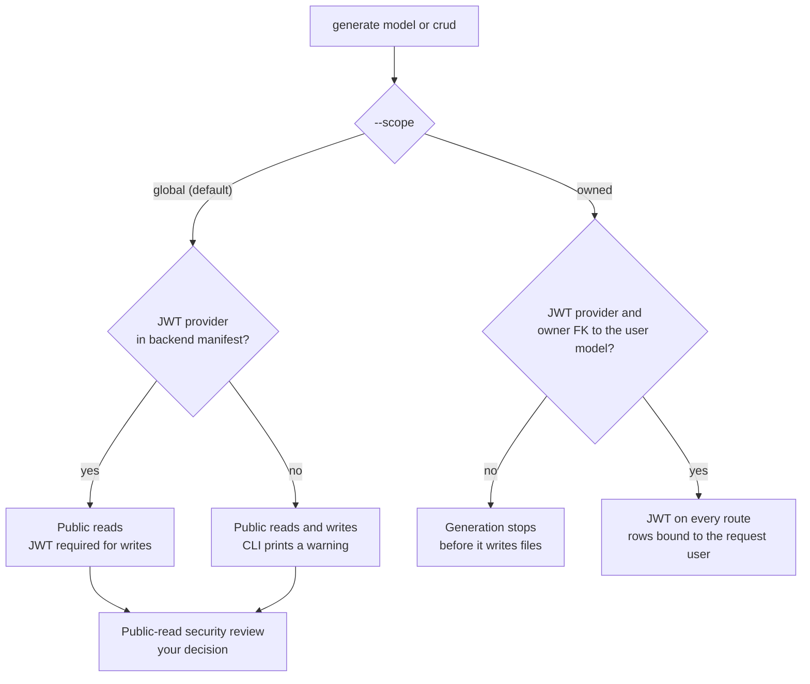

# mattstack CLI reference

This reference lists the commands and options that the current CLI declares.
Run `mattstack <command> --help` for the authoritative option list.
Every command accepts the global `-v, --verbose` and `-q, --quiet` options.

Related guides:

- [Deployment guide](deployment-guide.md): provider recipes, public edges, and
  the work that remains yours after generation.
- [Ecosystem guide](ecosystem.md): source repositories, presets, user
  configuration, and optional tools.
- [Architecture](architecture.md): how the CLI plans and writes files.

## Scaffold

### `mattstack init`

Create a project from the interactive wizard, a preset, or a YAML config file.
`mattstack create` is an alias with the same name, preset, config, iOS, output,
and dry-run options. Only `init` accepts the runtime flags.

```bash
mattstack init                                  # Interactive wizard
mattstack init my-app -p starter-fullstack      # Preset
mattstack init my-app -p starter-api --task-backend huey
mattstack init my-app -p starter-fullstack --ios
mattstack init -c project.yaml                  # Config file
mattstack init my-app -p kibo-fullstack --dry-run
```

| Option | Description |
|---|---|
| `-p, --preset` | Named preset. Run `mattstack presets` or see the [preset reference](#preset-reference). |
| `-c, --config` | Scaffold YAML file. See the [config file format](#config-file-format). |
| `--ios` | Include the Swift iOS client. Presets must be fullstack. |
| `-o, --output` | Parent directory for the project. Default: the current directory. |
| `--dry-run` | Preview the plan without writing files. |
| `--task-backend` | `celery`, `huey`, `django_q`, `django_rq`, `dramatiq`, or `none`. |
| `--realtime / --no-realtime` | Add the Django Ninja Centrifugo profile. Default: off. |
| `--media-storage` | Django Ninja production media: `local` (default) or `s3`. |
| `--ai` | Django Ninja AI layer vector store: `none` (default), `pgvector`, or `qdrant`. See [AI layer](#ai-layer). |
| `--graph` | Django Ninja AI layer graph queries: `cte` (default) or `neo4j`. |

For unattended use, provide a name and a preset, or a config file. Do not
combine `--config` with a name or preset. Dry runs do not change files.
Initialization failures return nonzero.

Select the deployment target only with `deployment:` in a config file. The
wizard and presets use `docker`. The CLI rejects unsupported target
combinations before it clones any source. See
[supported combinations](deployment-guide.md#supported-combinations).

`init` clones the published default branch of each selected source. To use a
local checkout instead, set `MATTSTACK_SOURCE_<KEY>`, where `<KEY>` is the
source key in upper case with `-` changed to `_`:

```bash
MATTSTACK_SOURCE_DJANGO_NINJA=~/dev/django-ninja-boilerplate mattstack init my-app -p starter-api
```

The variable overrides the built-in URL and any `repos:` entry. When its value
is a local directory, `init` copies the working tree, including uncommitted
changes, and skips files that `.gitignore` excludes. See
[source provenance](ecosystem.md#source-provenance).

Generated projects store nonsecret stack metadata in `mattstack.yml`. Do not
store credentials there.

### Choose runtime services

Each project has at most one selected backend, one selected frontend, and one
selected task backend. Backend-only and frontend-only projects are valid.
Realtime and S3 media are opt-in Django Ninja profiles.

| Backend | Task backends | Worker targets |
|---|---|---|
| Django Ninja | `celery` (default), `huey`, `django_q`, `django_rq`, `dramatiq`, `none` | `make backend-worker`; `make backend-beat` for Celery only |
| Django Matt | `celery` (default), `none` | `make backend-worker`; `make backend-beat` for Celery |
| FastAPI | `celery` (default), `none` | `make backend-worker`; `make backend-beat` for Celery |
| NestJS | Bull queues inside the API process | None; the CLI sets the task backend to `none` |
| Frontend-only | `none` | None |

Use `backend.task_backend`, `backend.realtime`, and `backend.media_storage` in
scaffold YAML. CLI flags override these values. With `none`, no worker exists,
and Django Ninja rejects enqueue attempts instead of dropping jobs.

Run `make setup` before you run quality commands. Start the selected queue
consumer in one of two ways:

- Host: `make backend-worker`, plus `make backend-beat` for the Celery scheduler.
- Compose: `make up-<profile>`. The profiles are `celery`, `huey`, `django-q`,
  `django-rq`, and `dramatiq`.

Missing worker targets fail instead of reporting success. Apply migrations with
the selected `TASK_BACKEND`; django-q needs its own tables. Production Compose
runs the selected worker services without a profile. The
[deployment guide](deployment-guide.md#generated-recipes) lists how each cloud
recipe runs them.

The Django Ninja backend needs Redis for cache, sessions, and throttling, even
with `--task-backend none`. Any task backend other than `none` also needs Redis.

#### Realtime

Run `make up-realtime` to start Centrifugo v5 for development. The development
port binds to `127.0.0.1` and defaults to `8800`. The admin UI is off.

The generated `.env` contains the realtime secrets; keep it private. The
example file has empty placeholders. Centrifugo verifies client tokens with
`CENTRIFUGO_TOKEN_SECRET`. mattstack does not generate a token endpoint. Issue
connection and channel tokens only from an authenticated API endpoint in your
backend source.

For production, set `CENTRIFUGO_API_KEY` and `CENTRIFUGO_ALLOWED_ORIGINS`.
Production Compose always runs Centrifugo for a realtime project. Cloud recipes
do not deploy it; you supply `CENTRIFUGO_URL` and `CENTRIFUGO_API_KEY`. See
[optional services in production](deployment-guide.md#optional-services-in-production).

#### S3 media

Set `AWS_STORAGE_BUCKET_NAME`, `AWS_ACCESS_KEY_ID`, and `AWS_SECRET_ACCESS_KEY`
in `.env.production` or your provider's secret manager. Set
`AWS_S3_REGION_NAME` to your bucket's region. Compose defaults it to
`us-east-1`; cloud recipes do not set it. Development media stays local.

#### AI layer

`--ai` and `--graph` need the Django Ninja backend and its `core/ai` package
and `ai` extra; `--graph age` is rejected. Any choice other than
`--ai none --graph cte` sets `AI_ENABLED=true`, `UV_EXTRAS=ai`, and
`POSTGRES_IMAGE=pgvector/pgvector:pg<major>` in both env files, where
`<major>` matches the backend's Postgres image.

- `--ai qdrant` adds a development `qdrant` service on the `ai` Compose
  profile.
- `--graph neo4j` adds a development `neo4j` service on the `graph` Compose
  profile and a generated `NEO4J_PASSWORD`.

Start a profile with `docker compose --profile ai up -d`. Scaffold YAML has no
keys for these choices; `mattstack.yml` records them as `project.backend.ai`
and `project.backend.graph`.

#### Generated secrets

`init` writes `.env.example` and `.env.production.example` with empty secret
values, then creates the gitignored `.env` and `.env.production` with mode
0600. Each file gets its own fresh values for the secrets the selected stack
reads, such as `POSTGRES_PASSWORD`, `SECRET_KEY`, and `REDIS_PASSWORD`. Keys
are 64 URL-safe characters; passwords are 48 hexadecimal characters. `init`
prints only the names and never replaces an existing file.

To create a missing file later, for example in a fresh clone, run:

```bash
mattstack env secrets         # .env and .env.production from their examples
```

`env secrets` fills every empty known secret in each example and keeps an
existing `.env` or `.env.production` unchanged. It exits 1 when neither
example exists.

### `mattstack add`

Add one component to an existing project.

```bash
mattstack add frontend                          # React Vite
mattstack add frontend -f react-rsbuild
mattstack add backend                           # Django Ninja with Celery
mattstack add backend -f fastapi
mattstack add ios
mattstack add frontend --path /path/to/project --dry-run
```

| Option | Description |
|---|---|
| `-f, --framework` | Frontend or backend framework. `ios` rejects this option. |
| `-p, --path` | Project root. |
| `--dry-run` | Preview without writing files. |
| `--force` | Replace existing root configuration. |

Without `--force`, `add` keeps your files and stages alternatives as
`.mattstack-new`. Like `init`, `add` clones the published default branch.

### `mattstack upgrade`

Compare the project with its sources since the commit `init` or `add`
recorded in `mattstack.yml` (`project.<component>.source`).

```bash
mattstack upgrade                     # Preview every component
mattstack upgrade -c frontend         # One component: backend or frontend
mattstack upgrade --force             # Apply new, updated, and merged files
```

With a recorded commit, upgrade compares three ways. It leaves files that
upstream did not change, replaces files that only upstream changed, and merges
files that both sides changed with `git merge-file`. It reports a conflicting
merge and never writes it; the recorded commit moves forward only when no
conflict remains. Files and directories the project removed stay removed.
Without a recorded commit, upgrade compares two ways and `--force` replaces
every file that differs from upstream.

Upgrade checks every selected component before it writes files. It prints
diffs, ignores upstream deletions, and rejects symbolic-link paths and git
remote-helper sources (`<transport>::<address>`). It exits 1 when it cannot
compare a component.

---

## Generate

`generate model`, `crud`, `endpoint`, and `schema` support Django backends that
use `NinjaExtraAPI` (Django Ninja) or `DjangoMattAPI` (Django Matt). Plain
`NinjaAPI`, FastAPI, and NestJS backends are not supported. Frontend generators
use the detected frontend layout and router.

### `mattstack generate model`

```bash
mattstack generate model Product --fields "name:str price:decimal active:bool"
```

Create the Django model, request and response schemas, a registered controller,
and admin registration. Then run
`mattstack db makemigrations && mattstack db migrate`.

Options: `-f, --fields` (repeatable), `-a, --app`, `-p, --path`, `--empty`
(allow no fields), `--dry-run`, `--force`, and the
[resource policy](#choose-a-resource-policy) options.

### `mattstack generate crud`

```bash
mattstack generate crud Product -f "name:str price:decimal" -f active:bool --app core
```

Create the model, schemas, controller, frontend client, hooks, and components
in your existing app and frontend layout. Generated controllers register with
the detected API. The CRUD frontend requires `@tanstack/react-query`.

Foreign keys use the target model's primary-key type. Partial updates keep
omitted fields and reject explicit nulls for non-nullable fields. Use `--force`
to replace generated files. Use `--with-tests` to add pytest API tests, and a
Vitest test when the frontend has Vitest.

When your Ninja backend defines `CamelCaseSchema`, generated schemas inherit it
and keep its camelCase wire keys. ORM writes use validated Python field names.
Generation keeps existing package exports and rejects dynamic `__all__`
definitions before it writes.

### Choose a resource policy

`generate model` and `generate crud` share these options:

| Option | Values |
|---|---|
| `--scope` | `global` (default) or `owned` |
| `--owner-field` | Required for `owned`: a field such as `owner:fk:User` |
| `--lifecycle` | `base` (default), `timestamped`, or `soft-delete` |
| `--with-service` | Move database operations into a registered service |

```bash
mattstack generate crud Note --app todos \
  --fields "title:str unit_price:decimal owner:fk:User" \
  --scope owned --owner-field owner --lifecycle soft-delete \
  --with-service --with-tests
```

A JWT provider means `django-ninja-jwt` (Django Ninja) or `django-matt[auth]`
(Django Matt) in the backend manifest.



| Policy | Reads | Writes |
|---|---|---|
| `global` with JWT provider | Public | Any authenticated caller can change any row. |
| `global` without JWT provider | Public | Public. |
| `owned` | JWT; another user's row returns 404. | JWT; creation binds the request user. |

Both `generate model` and `generate crud` create schemas and register a backend
controller. `generate crud` also plans the frontend artifacts when one exists.

A User foreign key alone grants no ownership. Owned resources exclude the owner
field from input schemas. Generation rejects missing ownership prerequisites
before it writes files. The CLI prints the selected policy. Without a JWT
provider, it prints:

> Policy: global public reads AND writes because this backend has no JWT
> provider. Install an auth provider and use --scope owned --owner-field
> <user-fk> before exposing private resources.

#### Public-read security review

Global reads are always anonymous. When your backend contains
`core/tests/test_route_auth.py`, the CLI also prints a security review warning
for the two new `GET` operations. The generator does not add them to
`PUBLIC_OPERATIONS` and does not waive the route-auth gate. Do this yourself:

1. Confirm that anonymous reads of this resource are acceptable.
2. Add only those two `GET` operations to `PUBLIC_OPERATIONS` in
   `backend/core/tests/test_route_auth.py`.
3. Run `cd backend && just gauntlet-quick`.

For private data, use `--scope owned --owner-field <user-fk>` instead.

#### Lifecycle and services

Use `--lifecycle base`, `timestamped`, or `soft-delete` with the source
backend's base classes. Soft deletion keeps the database row and excludes it
from active queries. Fields that redeclare inherited fields are rejected.
`--with-service` writes `<app>/services/<name>_service.py`; it fails when
`services.py` is a module.

### `mattstack generate endpoint`

```bash
mattstack generate endpoint /products/featured --method GET --auth
```

Add an endpoint stub that returns 501 until you implement it. The first path
segment selects the controller that serves `/<segment>`. When none exists, the
command creates and registers one. Options: `-m, --method` (`GET`, `POST`,
`PUT`, `PATCH`, `DELETE`), `--auth`, `-a, --app`, `-p, --path`, and
`--dry-run`. `--auth` requires a JWT provider.

### `mattstack generate schema`

```bash
mattstack generate schema Product -f "name:str price:decimal"
```

Generate base, create, update, and response schemas without a model. Options:
`-f, --fields`, `-a, --app`, `-p, --path`, `--dry-run`, and `--force`.

### `mattstack generate component`

```bash
mattstack generate component ProductCard --with-test
```

Options: `--path` (directory relative to `frontend/`), `--with-test`,
`--project` (project root), `--dry-run`, and `--force`.

### `mattstack generate page`

```bash
mattstack generate page Products
mattstack generate page Reports --route '/(app)/_authed/reports/$reportId' --guard --error
```

Options: `--path`, `--project`, `--dry-run`, `--force`, `--route`, `--route-group`,
`--guard`, `--pending`, `--error`, and `--lazy`. The project root option is
`--project` because `--path` sets the output directory.

### `mattstack generate hook`

```bash
mattstack generate hook useProducts
```

Options: `--path`, `--project`, `--dry-run`, and `--force`.

### Routing and authorization

Each frontend keeps its native router. Generated route options change browser
navigation only. They do not authorize API access. Protect data with the
backend [resource policy](#choose-a-resource-policy).

| Router | Route options |
|---|---|
| TanStack Router (Vite and Rsbuild) | `--route`, `--guard`, `--pending` (CRUD only), `--error` |
| React Router | `--route-group public` or `protected`, `--error` and `--lazy` for data routers |
| Next.js App Router | `--app-group` for CRUD; a native `--route` for pages |

Use TanStack Router as the primary routing path for Vite and Rsbuild React
frontends. Page names use kebab-case URLs. CRUD pages use
`src/routes/<resource>/index.tsx`; nested index route IDs keep their trailing
slash. Run your dev server or build after generation to update the typed route
tree before typecheck. Generation reads the active plugin configuration or
`tsr.config.json`, including custom route directories, tree files, and tokens.
Use a router-native path for groups, pathless layouts, and parameters.

- `--guard` uses the detected auth store and login route. It redirects the
  browser; the API still enforces access.
- `--pending` needs a real CRUD loader and query-client router context. A plain
  page has no loader and rejects this option.
- React Router supports static JSX, data-router declarations, and `useRoutes`
  arrays, including supported imported arrays. `--error` and `--lazy` need a
  data router. `protected` registers the page under the `ProtectedRoute` group,
  which is a client-side redirect.
- Next.js generation keeps existing layouts and route groups, and rejects URL
  collisions across groups.

Computed configuration, ambiguous registrations, duplicate URLs, and route or
layout conflicts stop generation before it writes files. `--force` requires a
matching existing registration. Generated Vite builds run the router plugin
before TypeScript checks new route IDs. Use the Node.js version that your
frontend source supports; the exercised runtime is Node.js 22.

The frontend route inventory in `mattstack context` is not a backend endpoint
or authorization report.

---

## Database

Database commands support Django backends only. Run them from the project root
or a nested directory. They load the root `.env`; exported shell variables take
precedence. Failures keep stderr and return nonzero. Each command accepts
`-p, --path`.

| Command | Action |
|---|---|
| `mattstack db migrate` | Run `manage.py migrate`. |
| `mattstack db makemigrations [-a APP]` | Create migrations. |
| `mattstack db status` | Show migration status. |
| `mattstack db seed [-f FILE] [--fresh]` | Run your seed script. `--fresh` flushes data first. |
| `mattstack db reset [--seed]` | Flush application data and run migrations. It does not drop the database. |
| `mattstack db shell` | Open a database shell. |
| `mattstack db dump [-a APP] [-o FILE]` | Export JSON fixtures with `dumpdata`. Without `-o`, write to stdout. |
| `mattstack db load FIXTURE` | Load a fixture with `loaddata`. |

The seed command validates the seed file before it flushes data. Use `--yes`
for unattended `seed --fresh` or `reset`. Remote, production, or unverified
targets also require `--force`. Check the displayed database target before you
confirm.

---

## Sync

The backend's OpenAPI document is the type contract. `@hey-api/openapi-ts`
generates the frontend types, SDK, Zod schemas, and TanStack Query hooks from
it. Commit the generated files; `mattstack sync check` keeps them current.

```bash
mattstack sync                      # Same as `mattstack sync openapi`
mattstack sync openapi              # Regenerate src/api/generated in the frontend
mattstack sync check                # Exit 1 when the committed output is stale
mattstack audit --type types        # Field-level OpenAPI ↔ Zod parity
```

`sync types`, `sync zod`, `sync api-client`, and `sync all` are deprecated
aliases. They accept only `-p, --path` and run `sync openapi`.

### `mattstack sync openapi`

Run the frontend's own `node_modules/.bin/openapi-ts` with the plugins
`@hey-api/typescript`, `@hey-api/sdk`, `zod`, and `@tanstack/react-query`. The
client is `@hey-api/client-axios` when the frontend depends on `axios`, else
`@hey-api/client-fetch`. The command does not download a tool or export a
schema.

| Option | Description |
|---|---|
| `--schema` | OpenAPI JSON file, relative to the project. |
| `-o, --output` | Output directory relative to the frontend. Default: `src/api/generated`. |
| `--force` | Replace edited or unmanaged output. |
| `-p, --path` | Project root. Default: the current directory. |

The frontend `package.json` must pin `@hey-api/openapi-ts` to an exact
version, and `node_modules` must contain that version. A range such as
`^0.99.0` fails. `mattstack init` pins `0.99.0` when the frontend has no exact
pin.

For Django Ninja, the default schema is `backend/docs/openapi/openapi.json`
(`just openapi` in the backend writes it). Other backends use `openapi.json`
at the project root. When the Ninja export is missing, run the export command
that the CLI prints, then retry. The ownership manifest
`.mattstack-openapi.json` protects edited or unmanaged files. Exclude the
output directory from your frontend formatter, or `sync check` reports drift.

### `mattstack sync check`

Regenerate into a temporary directory and compare every file with the
committed output. On a difference, list the stale, missing, or extra files,
print the regenerate command, and exit 1. Options: `--schema`, `-o, --output`,
and `-p, --path`. Use it as a local gate or pre-push hook. It does not check
that the backend export is current; run the backend's `just openapi-check`
for that.

See [OpenAPI clients with Hey API](ecosystem.md#openapi-clients-with-hey-api)
and [Type contract](architecture.md#type-contract) for the type mapping and its
known gaps.

---

## Test, lint, and format

```bash
mattstack test                  # Backend, then frontend
mattstack test --parallel --coverage
mattstack test --backend-only
mattstack lint --parallel
mattstack lint --fix --format-check
mattstack fmt                   # Same as lint --fix --format-check
```

`test` accepts `--backend-only`, `--frontend-only`, `--coverage`, `--parallel`,
and `-p, --path`. `lint` accepts `--fix`, `--format-check`, `--backend-only`,
`--frontend-only`, `--parallel`, and `-p, --path`. `fmt` accepts
`--backend-only`, `--frontend-only`, and `-p, --path`.

Parallel lint includes format checks. Both runners return nonzero when any
selected job fails. Child output and labels render as literal text.

Generated React frontends use Oxlint (`lint`, `lint:strict`, `lint:fix`) and
Oxfmt (`format`, `format:check`). Run `make setup` after generation to refresh
the cloned lockfile and format frontend files changed by postprocessing. Use frozen
installs only after that refresh. Root hooks run frontend lint and a read-only format check, scoped
to `frontend/`. Next.js retains its existing lint workflow.

React Doctor is an application check, distinct from `mattstack doctor`:
`cd frontend && bun run doctor` uses the pinned local package, disables telemetry
and supply-chain scanning, and blocks on errors. Add `--json` for machine output.
The cloned frontend's `DESIGN.md`, theme tokens, and starter composition are
preserved; use its edit map when changing the visual design.
When an older React source has no Oxlint configuration, the CLI seeds explicit
Hooks, unused-variable, prefer-const, and accessibility rules rather than enabling
the entire correctness category. React Compiler-only checks are not enabled:
these templates do not use React Compiler. Existing upstream Oxlint/Oxfmt
configurations remain authoritative and are preserved.


---

## Audit

Run static analysis across six built-in domains and any
[audit plugins](plugin-guide.md).

```bash
mattstack audit                                   # All domains
mattstack audit --type types                      # Pydantic and TypeScript drift
mattstack audit --type quality                    # TODOs, stubs, hardcoded credentials
mattstack audit --type endpoints,tests --no-todo
mattstack audit --type dependencies --type vulnerabilities
mattstack audit --severity error
mattstack audit --live --base-url http://localhost:8000   # GET probes only
mattstack audit --html                            # Writes audit-report.html
mattstack audit --json > audit.json
```

Other options: `--fix` removes debug statements, and a positional path selects
the project.

Without `--json` or `--no-todo`, audit writes error and warning findings to a
marked section of `tasks/todo.md`. It replaces an existing section or creates
the file. JSON mode never writes the todo file. JSON output goes to stdout and
diagnostics to stderr. Audit returns nonzero for error findings, even when a
display filter hides them.

`--versions` runs only the version drift report. It lists each tool and
service version (Python, uv, Bun, Node, Postgres, Valkey, and key packages)
with every file that records it: lockfiles, manifests, Compose images, and
Dockerfiles. Two pins disagree when they differ at the precision both record,
so `3.13` and `3.13.15` agree. A range such as `>=3.13` is a floor; only a pin
below it disagrees. The report exits 1 on any drift. `--json` prints
`{"versions": ..., "findings": ...}`.

```bash
mattstack audit --versions
```

---

## Dev

### `mattstack dev`

Start infrastructure and the selected applications, then supervise them until
you press Ctrl+C.

```bash
mattstack dev                       # Mode from mattstack.yml, else host
mattstack dev --mode container
mattstack dev --no-docker           # Infrastructure is already running
mattstack dev -s backend,docker     # Select services
```

- Infrastructure means the Compose `db` and `redis` services, when defined.
- `--mode host` runs the applications on your host and only infrastructure in
  Compose. The host backend binds to `127.0.0.1`.
- `--mode container` adds the `api-dev` and `frontend-dev` containers.
- `--no-docker` skips infrastructure. It cannot be combined with container mode.
- `mattstack dev` does not start task workers or Centrifugo. Start them with
  `make backend-worker`, `make up-<profile>`, or `make up-realtime`.

Commands use configured ports. Shutdown stops the selected application
processes or containers and leaves infrastructure running.

Development Compose publishes database, Redis, API, frontend, and Centrifugo
ports on `127.0.0.1` only. Change host mappings explicitly if you need LAN
access. Keep container listeners separate from host publishing.

Keep credentials in runtime environment files, not Docker images. The generated
root `.dockerignore` excludes dotenv files, host virtual environments,
dependency directories, and build caches. Pass browser API configuration through
the generated Docker build arguments; do not depend on copying `frontend/.env`.
For production settings, see the
[deployment guide](deployment-guide.md#production-prerequisites).

---

## Dependencies

| Command | Action |
|---|---|
| `mattstack deps check` | List outdated backend and frontend packages. |
| `mattstack deps update` | Run `uv lock --upgrade` and `uv sync` for the backend, and the package manager's update for the frontend. |
| `mattstack deps audit` | Run `pip-audit` and the frontend package manager's audit. |

Backend checks use the backend virtual environment: `UV_PROJECT_ENVIRONMENT`
when set, or `.venv` otherwise. Create that environment before you check it;
the CLI's active environment does not count as the backend environment.

Backend audits run `python -m pip_audit` through the backend's uv project
without syncing or removing installed runtime extras. Install the auditor in
that project's development environment with `uv add --dev pip-audit`; a global
executable does not verify the backend. Audits skip your editable application
package, but treat unverified third-party package records as incomplete.
`deps check` exits with code 1 if a selected component cannot be checked.
`deps audit` exits with code 1 for vulnerabilities, missing tools, failed
scans, or invalid reports. A clean frontend cannot hide a failed backend scan.

Component selection includes Python backends, NestJS backends, and JavaScript
frontends. NestJS uses its own resolved JavaScript package manager for all
three operations. Audit findings retain the `backend` source label.

`deps update` is not interactive and rewrites lockfiles. It accepts
`--backend-only`, `--frontend-only`, and `--major`. `--major` affects JavaScript
components; `uv lock --upgrade` already upgrades Python packages as far as
`pyproject.toml` allows. Backend sync preserves the selected task extra and
declared `dev` extra or dependency group, but removes unselected extras.
Review both lockfiles before you commit. Each command accepts `-p, --path`.

---

## Health

### `mattstack health`

Check only the services that your project defines, with its configured ports.

```bash
mattstack health
mattstack health --live --json
```

---

## Hooks, workflow, and protection

### `mattstack hooks install`

Install the Git hook stages that the selected source's
`.pre-commit-config.yaml` declares, then verify the hook files. The Django
Ninja source runs Ruff at commit time and `just gauntlet-quick` before push,
with locked backend development tools. Install `uv`, `just`, and `bun` as
required. Missing prerequisites fail before hooks are written.
pre-commit refuses to install while `core.hooksPath` is set; unset a stale
value with `git config --unset-all core.hooksPath`, then rerun.

A passing gate can still print nonblocking findings. Read them; they are not an
all-clear result.

Run `mattstack hooks status` to show installed hooks. Run
`mattstack hooks run` to run pre-commit on all files.

### `mattstack workflow`

Generated projects run every gate locally and have no hosted CI. `make
gauntlet` runs the backend's `just gauntlet` and the frontend's `gauntlet`
script, or their lint and test targets when a component has no gate. A Django
or FastAPI fullstack project then runs `mattstack sync check`, and every
project ends with `mattstack audit --no-todo`. For Django Ninja, the pre-push
hook from `mattstack hooks install` runs the backend's `just gauntlet-quick`.

`mattstack workflow` generates hosted CI only when you opt in with `--ci`.
Without it, the command prints the local gates and exits 2.

```bash
mattstack workflow --ci github              # .github/workflows/ci.yml
mattstack workflow --ci gitlab              # .gitlab-ci.yml
mattstack workflow --ci github --dry-run
```

Each push and pull request then spends hosted CI minutes. Existing workflow
files stay unchanged unless you pass `--force`. Every workflow includes a
`gauntlet` job that installs mattstack from the CLI repository's default
branch and runs `mattstack audit --no-todo`. Python jobs pin uv, Python,
Postgres, and Valkey to the versions the project records: GitHub Actions uses
`astral-sh/setup-uv`, and GitLab CI uses the
`ghcr.io/astral-sh/uv:<uv>-python<python>-trixie-slim` image.

### `mattstack protect`

Enable branch protection: a no-commit-to-branch hook, CODEOWNERS, and a GitHub
ruleset that requires the `gauntlet` check. Use `--dry-run` to preview. Only a
`mattstack workflow --ci github` workflow reports that check.

---

## Project information and utilities

| Command | Action |
|---|---|
| `mattstack info`, `mattstack presets` | Show presets, source repositories, and usage. |
| `mattstack config [show\|path\|init]` | Show, locate, or create `~/.mattstack/config.yaml`. `init` overwrites an existing file. |
| `mattstack env [check\|sync\|show\|secrets]` | Compare `.env` with `.env.example`, append missing variables, show masked values, or create missing `.env` and `.env.production` files with generated secrets. |
| `mattstack doctor [--path P] [--json]` | Check required tools (`uv`, `bun`, Docker, and `just` when the backend has a `justfile`), the installed `pre-push` hook, and each `.mcp.json` server. Busy ports are informational; a missing project directory fails. |
| `mattstack version` | Show the version and check for updates, unless `--quiet` is set. |
| `mattstack completions --install` | Install shell completions. `--show` prints the script. |
| `mattstack verify --scope` | Fail when changed files are outside `SCOPE.md` or `--scope-file`. |
| `mattstack notify` | Send a deploy notification through the backend in `mattstack.yml`. |

Compose is optional for `doctor` when your project does not define it. Doctor
checks a stdio MCP server's command on `PATH` and an HTTP server's TCP port;
it never starts a server.
`verify --scope` fails closed when Git cannot report changes.

### `mattstack rules`

Generate the root agent files that describe the project's stack.

```bash
mattstack rules             # AGENTS.md, CLAUDE.md, .cursorrules, .claude/settings.json
mattstack rules --gsd       # Also .planning/ project files
mattstack rules sync        # Adapters from .omp/ and .context/
```

`AGENTS.md` points at each component's own guidance and lists cross-stack
rules and the testing policy. `CLAUDE.md` is the import `@AGENTS.md`, and
`.cursorrules` points at `AGENTS.md`. `.claude/settings.json` denies
`git push` and `rm -rf`; mattstack never writes `.claude/settings.local.json`.
`.mcp.json` appears only when every component declares the same server.
Existing files stay unchanged unless you pass `--force`. `rules sync` updates
harness adapters without replacing the component's own rules or duplicating
Claude guidance. Both accept `--dry-run`.

### `mattstack context`

Print project context as Markdown, JSON, or Claude format.

```bash
mattstack context full . --format json
mattstack context stack . --format claude
mattstack context routes . --output routes.md
```

Subcommands: `full`, `stack`, `models`, `routes`, and `types`. Pass the project
path as a positional argument. Options: `-f, --format`, `-o, --output`, and
`--max-tokens`. `full` also accepts `-w, --watch`.

### `mattstack client`

Run frontend package-manager commands from any project directory.

```bash
mattstack client add @hey-api/openapi-ts@0.99.0 --dev --exact
mattstack client run build
mattstack client exec tsc -- --noEmit
mattstack client which
```

Subcommands: `add`, `remove`, `install`, `run`, `dev`, `build`, `exec`, and
`which`. Use `--pm` to override the detected package manager.

### `mattstack board` and `mattstack todo`

`board` creates, lists, claims, and transitions tasks on the board configured in
`mattstack.yml`. `board link-pr` links a pull request, and `board sync` pushes
open items from `tasks/todo.md`. `todo move` moves a checked item from
`tasks/todo.md` to `completed.md`.

---

## Config file format

Use `mattstack init -c project.yaml` to scaffold from a file:

```yaml
name: my-app
type: fullstack                   # fullstack | backend-only | frontend-only
variant: starter                  # starter | b2b
backend:
  framework: django-ninja         # django-ninja | django-matt | fastapi | nestjs
  task_backend: celery            # See "Choose runtime services"
  realtime: false                 # Django Ninja only
  media_storage: local            # local | s3; Django Ninja only
frontend:
  framework: react-rsbuild-kibo   # react-vite | react-vite-starter | react-rsbuild | react-rsbuild-kibo | nextjs
ios: false
deployment: docker                # See the deployment guide
author:
  name: Your Name
  email: you@example.com
```

Deployment values: `docker`, `railway`, `render`, `fly-io`, `cloudflare`,
`digital-ocean`, `aws`, `gcp`, `hetzner`, and `self-hosted`.

The legacy `backend.celery` boolean still works; an explicit `task_backend`
wins. `backend.redis: false` takes effect only for Django Matt or FastAPI with
`task_backend: none`. The CLI ignores unknown keys.

---

## Preset reference

Run `mattstack presets` to list presets. Presets select frameworks. Python
backend presets default to the Celery task backend; override it with
`--task-backend`. Frontend-only presets use `none`, and NestJS presets run Bull
inside the API.
Presets do not select a deployment target.

### Django Ninja presets

| Preset | Variant | Frontend |
|---|---|---|
| `starter-fullstack` | starter | react-vite |
| `b2b-fullstack` | b2b | react-vite |
| `starter-api` | starter | — |
| `b2b-api` | b2b | — |
| `rsbuild-fullstack` | starter | react-rsbuild |
| `kibo-fullstack` | starter | react-rsbuild-kibo |
| `nextjs-fullstack` | starter | nextjs |

### Django Matt presets

| Preset | Variant | Frontend |
|---|---|---|
| `matt-api` | starter | — |
| `matt-fullstack` | starter | react-vite |
| `matt-b2b-fullstack` | b2b | react-vite |
| `matt-blog` | starter | react-vite |
| `matt-portfolio` | starter | react-vite |
| `matt-ecommerce` | starter | react-vite |

`matt-blog`, `matt-portfolio`, and `matt-ecommerce` clone the same sources as
`matt-fullstack`. mattstack does not add blog, portfolio, or ecommerce code.

### FastAPI presets

| Preset | Variant | Frontend |
|---|---|---|
| `fastapi-api` | starter | — |
| `fastapi-fullstack` | starter | react-vite |
| `fastapi-b2b-fullstack` | b2b | react-vite |
| `fastapi-rsbuild-fullstack` | starter | react-rsbuild |
| `fastapi-nextjs-fullstack` | starter | nextjs |

### NestJS presets

NestJS projects use port 4000 for the API and run Bull queues inside the API.

| Preset | Frontend |
|---|---|
| `nestjs-api` | — |
| `nestjs-fullstack` | react-vite |
| `nestjs-rsbuild-fullstack` | react-rsbuild |
| `nestjs-nextjs-fullstack` | nextjs |

### Frontend-only presets

| Preset | Framework |
|---|---|
| `starter-frontend` | react-vite |
| `simple-frontend` | react-vite-starter |
| `rsbuild-frontend` | react-rsbuild |
| `kibo-frontend` | react-rsbuild-kibo |
| `nextjs-frontend` | nextjs |
