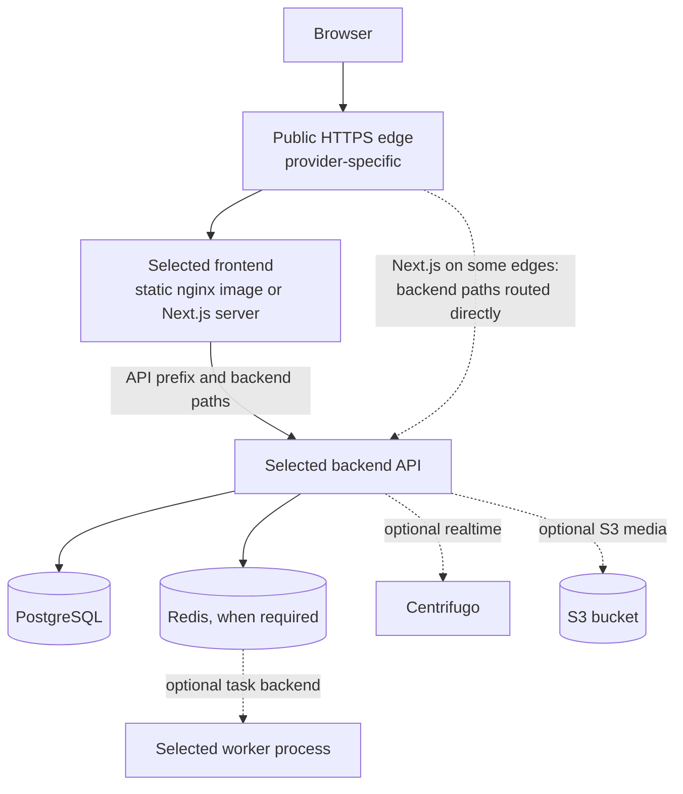

# mattstack deployment guide

mattstack generates a deployment recipe for one target. The recipe is a
starting point: you own the provider account, DNS, secrets, and a live smoke
test. This guide explains what each recipe contains and what remains yours.

Select the target in your scaffold YAML. `init` has no deployment flag, and the
wizard and presets use `docker`.

```yaml
name: my-app
type: fullstack
backend:
  framework: django-ninja
  task_backend: celery
frontend:
  framework: react-rsbuild-kibo
deployment: render
```

Run `mattstack init --config project.yaml`. Deployment values: `docker`,
`railway`, `render`, `fly-io`, `cloudflare`, `digital-ocean`, `aws`, `gcp`,
`hetzner`, and `self-hosted`. Use the generated recipe for exact commands,
variable names, image paths, and secret setup. For task backends, realtime, and
S3, see [choose runtime services](commands.md#choose-runtime-services).

Keep FastAPI's Celery broker on Redis database 1 and its result backend on
database 2 in host and container modes. Generated `.env` files and Compose
environments now use the same databases. Django backends keep database 0 for
both. Do not connect a host worker to database 0 while its FastAPI producer
publishes to database 1.

## Request path

A generated project has at most one selected frontend and one selected backend.
Backend-only projects omit the frontend; frontend-only projects omit the API and
its infrastructure. Dashed lines show optional services.



This is the common shape, not a guarantee for every provider. The
[generated recipes](#generated-recipes) table shows where each target differs.
Railway deploys no frontend, and Cloudflare Pages calls the API cross-origin.

By default, the browser calls a same-origin, relative API prefix such as
`/api`. A static frontend's nginx proxies the API prefix to `API_UPSTREAM`.
For Django, it also proxies `/admin`, `/media`, and `/static`. A Next.js server
rewrites the API prefix to `INTERNAL_API_URL`, which is set at build time.

## Supported combinations

Generation rejects these combinations before it clones any source:

- Backend-only or Next.js with Cloudflare. Choose Docker or another API host.
- Next.js fullstack with Render. Choose a provider with the generated container
  routing contract, or deploy the frontend and API separately.
- Frontend-only with Railway, AWS, GCP, Hetzner, or self-hosted. Choose Docker,
  Render, Fly.io, DigitalOcean, or Cloudflare.

B2B presets keep their explicit frontend and router selection. Do not substitute
an unrelated B2B frontend with different auth and organization endpoints.

## Generated recipes

All container targets build from the repository root through
`docker/backend/Dockerfile` and `docker/frontend/Dockerfile`.

| Target | Files | Browser to API | Task workers |
|---|---|---|---|
| Docker | `docker-compose.yml`, `docker-compose.prod.yml` | Frontend container proxies to the `api` service | Compose services |
| Railway | `.railway/railway.ts`, pinned `.railway/package.json` | Backend only; the recipe deploys no frontend | One Railway service per process |
| Render | `render.yaml` | Static site rewrites backend paths to the API's `onrender.com` host before the SPA fallback | `worker` services |
| Fly.io | `fly.toml`; fullstack adds `fly.frontend.toml` | Public frontend app proxies to the private Flycast API | Fly process groups |
| DigitalOcean | `.do/app.yaml` | Static: frontend proxies to the API's private URL. Next.js: ingress routes backend paths to the API | `workers`; migration runs as a pre-deploy job |
| AWS | `ecs-task-definition.json`, Copilot manifests | ECS: frontend and API share one task. Copilot: frontend proxies to an internal Backend Service | Separate task definitions and Backend Services |
| GCP | `service.yaml`, `workerpool-*.yaml` | Frontend ingress container proxies to an API sidecar | One WorkerPool per process |
| Hetzner | `docker-compose.caddy.yml`, `Caddyfile` | Caddy terminates TLS and routes to the frontend; Next.js backend paths go to the API | Production Compose |
| Self-hosted | `docker-compose.nginx.yml`, `nginx.conf.template`, systemd unit | nginx terminates TLS, like the Hetzner routing | Production Compose |
| Cloudflare | `wrangler.toml`; with a backend, the Caddy files | Pages frontend calls an absolute HTTPS API URL set at build time | Production Compose on the API host |

Target-specific work:

- **Render:** the rewrite host is a guessed `<service>.onrender.com` name.
  Confirm it after the first Blueprint sync.
- **Railway:** IaC needs Railway CLI 5.42.1 or later, a login, and a linked
  project. Install the pinned local IaC package with Bun. Deploy a fullstack
  project's frontend separately and point it at the API.
- **Self-hosted:** the recipe gives a one-time `certbot certonly` command and a
  renewal container. It does not include certificates.
- **Cloudflare:** add the API domain to `ALLOWED_HOSTS`, and allow the Pages
  origin in CORS and, for Django, `CSRF_TRUSTED_ORIGINS`. Check that your auth
  flow works cross-origin.
- **GCP:** run migrations with the Cloud Run job commands in the recipe header.
  App Engine is not generated.

Each Python worker runs the selected command through `app-entrypoint`, after the
same runtime checks as the API. NestJS has no separate worker; Bull runs in the
API process.

## Optional services in production

Realtime and S3 are Django Ninja profiles. Cloud recipes do not provision them.

| Service | Compose targets (Docker, Hetzner, self-hosted, Cloudflare) | Cloud targets |
|---|---|---|
| Centrifugo | Production Compose runs it for realtime projects. | Run Centrifugo yourself. Set `CENTRIFUGO_URL` and `CENTRIFUGO_API_KEY`. |
| S3 media | Compose passes the S3 variables. `AWS_S3_REGION_NAME` defaults to `us-east-1`. | Set the bucket, access key, and secret. Set `AWS_S3_REGION_NAME` yourself. |

The generated edges do not route traffic to Centrifugo. Production Compose
publishes the Centrifugo port on every host interface over plain HTTP. Add a TLS
route and firewall rules before you expose realtime. Set
`CENTRIFUGO_ALLOWED_ORIGINS` to your frontend origins.

## Production prerequisites

1. Run `make setup`, then review and commit lockfile changes. `make setup` does
   not use locked installs, so it can rewrite `uv.lock` and `bun.lock`.
   Generated Docker and CI Bun installs use `--frozen-lockfile` and fail on
   `bun.lock` drift. The uv installs do not catch `uv.lock` drift: the backend
   image runs `uv sync` without `--locked`, and CI runs `uv sync --frozen`.
   Commit the reviewed `uv.lock` yourself. Project renaming updates the project
   name in `uv.lock` and the text `bun.lock`; other lockfiles are not changed.
   When the CLI changes a frontend dependency pin, it prints the manifest and
   the setup command.
2. Copy `.env.production.example` to the ignored `.env.production`, or set the
   same variables through your provider's secret manager.
3. Replace every placeholder. Use independent secret and signing keys.
4. Configure the real database. Django reads `DB_NAME`, `DB_USER`,
   `DB_PASSWORD`, `DB_HOST`, and `DB_PORT`; `DATABASE_URL` alone does not
   configure Django. FastAPI needs a `postgresql+asyncpg://` `DATABASE_URL`, and
   NestJS needs a Postgres `DATABASE_URL`.
5. Set frontend origins and allowed hosts. FastAPI origins use a JSON list,
   for example `["https://app.example.com"]`. FastAPI production also requires
   a non-localhost `WEBAUTHN_RP_ID` and an HTTPS `WEBAUTHN_ORIGIN`.
6. For Django in production, set `DJANGO_ENVIRONMENT=production`. Django Ninja
   also sets `ENVIRONMENT=production` and requires distinct `SECRET_KEY`,
   `NINJA_JWT_SIGNING_KEY`, and `CENTRIFUGO_TOKEN_SECRET` values.
7. For selected realtime or S3 profiles, set their
   [additional values](#optional-services-in-production). Do not commit them.
8. Build from the repository root, deploy the selected worker processes, apply
   migrations, and verify the API, frontend, admin, and media paths you use.

The production image starts through `app-entrypoint`. Modes are `serve`
(default), `migrate`, `check`, and `health`. Any other command, such as a worker
command, runs after the runtime checks.

The entrypoint rejects empty values, known placeholder defaults, and a Ninja JWT
signing key equal to `SECRET_KEY`. FastAPI secrets need at least 32 characters,
and NestJS JWT secrets need at least 16. Each failure prints the fix and a local
verification command. Run that command before you deploy:

```bash
# Compose targets
docker compose -f docker-compose.prod.yml --env-file .env.production run --rm --no-deps api check
```

Hetzner and Cloudflare add `-f docker-compose.caddy.yml`, and self-hosted adds
`-f docker-compose.nginx.yml`. Other targets print a `docker build` and
`docker run ... check` command. `check` prints `preflight: ok` without serving.

`APP_PORT` takes precedence over a provider's `PORT`; the GCP sidecar uses it.
Run `app-entrypoint health` inside the backend container to exercise its local
health endpoint.

## TLS and health probes

Django Ninja enables `USE_TLS` behind the generated TLS edges. Only the three
public health routes bypass SSL redirects; admin and staff detail routes still
redirect. Host validation remains active. Fresh clones of the published source
receive the same narrow settings change during initialization.

AWS recipes leave `USE_TLS` off until you configure an HTTPS listener. Then set
`USE_TLS=true` and keep the forwarded-proto headers. Docker's local plain-HTTP
recipe does not enable TLS and publishes the production API port on every host
interface. Do not expose either plain-HTTP recipe as a secure public deployment.

Health probes send a Host header that Django accepts:

- Railway allows its documented `healthcheck.railway.app` probe Host.
- Fly and Cloud Run send explicit probe Host headers.
- AWS backend-only Django can add its own task IP from ECS metadata. Failed
  discovery stops startup. In fullstack, the load balancer targets the frontend.
- Render allows its external hostname and a localhost probe. This Host behavior
  is based on staff and community reports and still needs a live provider check.
- DigitalOcean's Django probe is TCP-only. It proves that the port accepts a
  connection, not application or dependency health. Verify the HTTP API after
  deployment. A readiness response of 503 is a dependency failure, not success.

For Fly fullstack, follow both app recipes. Allocate the private Flycast
address before you deploy the frontend. Flycast is HTTP-only inside Fly's
private network; the frontend app provides the public HTTPS edge.

## Verification boundary

Local proof covers production Django Ninja startup, migrations, Caddy HTTPS
health and admin and static routing, HSTS, health Host validation, queue
consumption, and S3 upload and readback. Provider schemas and local IaC
validation do not prove a live cloud deployment.

Known gaps in that local proof:

- The proof used local source repositories with fixes that are not published
  yet. A fresh `init` clones the published default branch, which may not
  contain them. See [source provenance](ecosystem.md#source-provenance).
- Gates in the generated Ninja backend passed while reporting nonblocking
  findings. A passing gate can still print warnings; review them, because they
  are not an all-clear result.
- Django's deploy check run with test settings reports security warnings. Run
  the deploy check with your production settings before you release.

No billable cloud deployment has been run or approved. These items need an
authorized account and a real deployment smoke:

- Railway variable resolution
- Render rewrites and probes
- Fly.io Flycast networking
- DigitalOcean private bindings
- AWS IAM, load balancer, and service discovery
- GCP IAM and WorkerPool availability
- Cloudflare DNS and Pages

Issue [#9: align deployment providers with Ninja production settings](https://github.com/mattjaikaran/mattstack-cli/issues/9)
stays open until that evidence exists.
