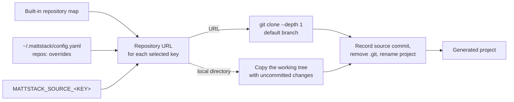

# mattstack ecosystem guide

This guide explains where generated code comes from and how you can customize
sources, presets, and defaults. It also lists optional tools that you can add to
a generated project.

## Source provenance

`mattstack init` and `mattstack add` copy code from source repositories.
`mattstack upgrade` compares your project with the same sources, using the
commit recorded in `mattstack.yml` as the merge base.



- The clone uses the remote default branch. mattstack does not pin a branch
  or tag.
- `mattstack.yml` records each component's source as
  `project.<component>.source`: `repo` (credentials removed), `commit`, and
  `dirty: true` when a copied working tree had uncommitted changes.
- `MATTSTACK_SOURCE_<KEY>` overrides the built-in URL and any `repos:` entry
  for one source. `<KEY>` is the source key in upper case with `-` changed to
  `_`, for example `MATTSTACK_SOURCE_DJANGO_NINJA` or
  `MATTSTACK_SOURCE_REACT_RSBUILD_KIBO`.
- When an override is a local directory, `init` copies its working tree:
  tracked and untracked files that `.gitignore` does not exclude. `add` and
  `upgrade` clone the same path, so they see only its committed state.

```bash
MATTSTACK_SOURCE_DJANGO_NINJA=~/dev/django-ninja-boilerplate \
  mattstack init my-app -p starter-api
```

Built-in keys:

| Key | Repository |
|---|---|
| `django-ninja` | [django-ninja-boilerplate](https://github.com/mattjaikaran/django-ninja-boilerplate) |
| `django-matt` | [django-matt-starter](https://github.com/mattjaikaran/django-matt-starter) |
| `fastapi` | [fastapi-boilerplate](https://github.com/mattjaikaran/fastapi-boilerplate) |
| `nestjs` | [nestjs-boilerplate](https://github.com/mattjaikaran/nestjs-boilerplate) |
| `react-vite` | [react-vite-boilerplate](https://github.com/mattjaikaran/react-vite-boilerplate) |
| `react-vite-starter` | [react-vite-starter](https://github.com/mattjaikaran/react-vite-starter) |
| `react-rsbuild` | [react-rsbuild-boilerplate](https://github.com/mattjaikaran/react-rsbuild-boilerplate) |
| `react-rsbuild-kibo` | [react-rsbuild-kibo-boilerplate](https://github.com/mattjaikaran/react-rsbuild-kibo-boilerplate) |
| `nextjs` | [nextjs-starter](https://github.com/mattjaikaran/nextjs-starter) |
| `swift-ios` | [swift-ios-starter](https://github.com/mattjaikaran/swift-ios-starter) |

The B2B variant uses the same repository key as the starter variant.

## Custom source repositories

Override built-in keys in `~/.mattstack/config.yaml`:

```yaml
repos:
  django-ninja: https://github.com/myorg/django-boilerplate.git
  nextjs: https://github.com/myorg/nextjs-starter.git
```

A user entry replaces the built-in URL with the same key. Use any URL or path
that `git clone` accepts. mattstack rejects values that start with `-` and git
remote-helper sources (`<transport>::<address>`). A `file://` URL clones the
local repository's checked-out branch at its last commit, so uncommitted edits
never reach the scaffold. A plain directory path makes `init` copy the working
tree instead, as `MATTSTACK_SOURCE_<KEY>` does.

mattstack clones only the built-in keys. A new key appears in `mattstack info`,
but no command clones it. Presets cannot select a repository; they select
framework keys.

## Custom presets

Define presets in `~/.mattstack/config.yaml`:

```yaml
presets:
  my-api:
    description: "Internal API template"
    project_type: backend-only
    backend_framework: django-ninja
    task_backend: none

  my-fullstack:
    description: "Our standard fullstack"
    project_type: fullstack
    variant: b2b
    backend_framework: fastapi
    frontend_framework: react-vite
    include_ios: true
    task_backend: celery
```

| Field | Type | Default | Description |
|---|---|---|---|
| `description` | string | auto | Human-readable description |
| `project_type` | string | `fullstack` | `fullstack`, `backend-only`, or `frontend-only` |
| `variant` | string | `starter` | `starter` or `b2b` |
| `backend_framework` | string | `django-ninja` | `django-ninja`, `django-matt`, `fastapi`, or `nestjs` |
| `frontend_framework` | string | `react-vite` | Explicit frontend and router selection |
| `include_ios` | bool | `false` | Include the iOS client |
| `task_backend` | string | `celery` | Django Ninja: all six choices. Django Matt and FastAPI: `celery` or `none`. NestJS: Bull in the API. |
| `use_realtime` | bool | `false` | Opt-in Django Ninja Centrifugo profile |

The legacy `use_celery` field maps to the task selection; an explicit
`task_backend` wins. Presets do not select a deployment target. mattstack
validates each user preset and skips an invalid preset with a warning.

Keep the selected frontend and router. B2B presets use the same explicit
TanStack source as their starter counterpart and add backend features. They do
not select `react-vite-b2b`: its organization, team, invitation, and auth API
contracts differ from the supported backends. Do not substitute that React
Router source silently.

## User defaults

mattstack reads one default:

```yaml
defaults:
  package_manager: bun    # bun | npm | yarn | pnpm
```

Commands that run frontend tools, such as `client`, `deps`, `dev`, `lint`, and
`test`, choose the package manager in this order: the `--pm` option, the
project's lockfile, this default, then `bun`. Run `mattstack client which` to
see the choice and its reason. Generated Makefiles use Bun.

The config template advertises only `package_manager` under `defaults`.
Set scaffold choices per project with a preset, a scaffold YAML file, or
`init` flags. Unsupported keys in `defaults` do not select scaffold features.
Choose either a preset or scaffold YAML; `init` refuses to combine them.
Explicit task, realtime, and media flags override the selected preset, YAML,
or wizard values. `--ios` enables iOS only for fullstack projects.
Other scaffold fields come from that mode and `ProjectConfig` defaults.
Package-manager defaults do not change scaffold fields. An invalid package
manager default fails when selected; an explicit manager or project lockfile
retains precedence.

## Config commands

```bash
mattstack config show   # Display current config
mattstack config path   # Print config file path
mattstack config init   # Write the template config
```

`config init` overwrites an existing file. Back it up first.

## Dependency and lock updates

`make setup` installs dependencies without locked mode, so it can update
`uv.lock` and `bun.lock`. It also requests the backend's `dev` extra when one
exists. For a Django Ninja task backend other than Celery, it adds that
backend's extra, for example `uv sync --extra huey`.

`mattstack deps update` runs `uv lock --upgrade`, then syncs the selected
task-backend extra and declared `dev` extra or dependency group. It removes
unselected extras; it does not retain obsolete packages with `--inexact`.
For NestJS, it runs the backend's JavaScript package manager.
`--major` affects JavaScript components; Python upgrades stay within
`pyproject.toml` constraints.

Review both lockfiles before you commit. Generated Bun installs use
`--frozen-lockfile` and fail on drift. The uv installs in the backend image and
CI do not detect a stale `uv.lock`. See
[production prerequisites](deployment-guide.md#production-prerequisites).

## Plugin system

See the [plugin guide](plugin-guide.md) to write custom audit plugins.

## Optional cross-language tools

Keep these tools optional. Install them in your generated project, not in
mattstack. Pin the version and commit the lockfile. Do not add a second gate
that repeats Gauntlet checks.

### OpenAPI clients with Hey API

The backend's OpenAPI document is the only type contract; `sync openapi` is
the only generator. See [sync](commands.md#sync). Do not install a second
client generator such as Orval.

```bash
mattstack client add @hey-api/openapi-ts@0.99.0 --dev --exact
mattstack sync openapi           # Prints the Ninja export command if the schema is missing
mattstack sync check             # Exit 1 when the committed client is stale
```

For Django Ninja, `sync openapi` reads `backend/docs/openapi/openapi.json`. When
the file is missing, the CLI prints an export command that loads the root
`.env` and runs `uv run python manage.py export_openapi` from the backend
directory. Run it, then retry. An explicit `--schema` overrides discovery.
Other backends use `openapi.json` at the project root unless you pass a path.
The CLI does not export your schema or install Hey API implicitly.

Use Node 22.18 or later. `sync openapi` runs only your installed local tool,
pinned to an exact version. The SDK, Zod, and TanStack Query plugins ship
inside `@hey-api/openapi-ts`; the generated code imports `zod`,
`@tanstack/react-query`, and, with the Axios client, `axios` from your
frontend. It rejects edited or unmanaged output unless you pass `--force`.
Keep the schema free of secrets. Check the generated client with your
frontend typecheck and API integration tests.

### React Doctor

Use React Doctor for React-specific diagnostics, not as a replacement for
your formatter, typechecker, tests, or accessibility checks.

```bash
mattstack client add react-doctor@0.9.14 --dev --exact
cd frontend
./node_modules/.bin/react-doctor . --yes --json --no-telemetry \
  --no-supply-chain --blocking error
```

Keep the JSON report outside commits when it contains source details.
Check each project's completion status and skipped checks; an empty
diagnostic list does not prove that analysis completed.
Use `--scope changed --base origin/main` only when that Git ref exists.
Review the [React Doctor license](https://github.com/millionco/react-doctor/blob/main/LICENSE):
its modified MIT terms restrict AI training and evaluation pipelines and some
paid hosted services. Do not enable it automatically in agent pipelines.
Read the [React Doctor CLI documentation](https://www.react.doctor/) for
the supported Node versions and flags.

### Rsdoctor and runtime checks

For an Rsbuild project, install `@rsdoctor/rspack-plugin@1.6.4` with
`mattstack client add --dev --exact`. Run your build with `RSDOCTOR=true`
when you need bundle or transform diagnostics. Keep it disabled for
normal builds. See the [Rsbuild Rsdoctor guide](https://rsbuild.rs/guide/debug/rsdoctor).

Use [Schemathesis](https://github.com/schemathesis/schemathesis) to test
your runtime OpenAPI contract. Pin a tested version with `uvx --from`.
Run it against a disposable database: generated requests can write data.
Use [Playwright with axe](https://playwright.dev/docs/accessibility-testing)
to verify rendered routes, authentication, API calls, and accessibility.

For backend development, consider
[Django extensions](https://django-extensions.readthedocs.io/en/latest/)
for management tools and
[django-migration-linter](https://github.com/3YOURMIND/django-migration-linter)
for deployment compatibility checks. Use the
[TanStack Router Devtools](https://tanstack.com/router/latest/docs/framework/react/devtools)
version that matches your router; do not change your router for this tool.
